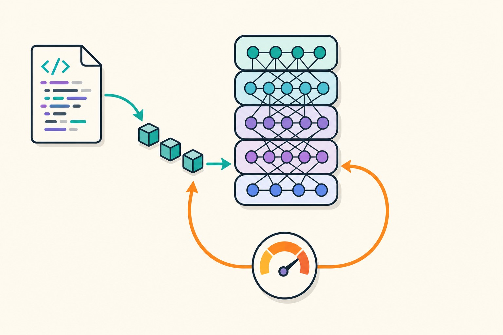

## Introduction

I work on image processing and sensor algorithms, and PyTorch is the tool I reach for whenever a classical pipeline stops being enough and a learned model needs to take over. What kept tripping me up early on was not the math — it was not understanding how PyTorch's pieces fit together: why a tensor suddenly complains about being on the wrong device, why memory usage doubles during inference, why loading a saved model breaks after a refactor.

PyTorch has become the go‑to tensor library for researchers and engineers looking to prototype quickly and then ship production models. Unlike its older colleague TensorFlow, which once favored static graphs, PyTorch embraces dynamic computation through eager execution and a Python‑centric design. This means you can write code that feels like ordinary Python, debug it with standard tools, and still leverage GPU acceleration and distributed training. In this post, I'll walk through the three core layers of PyTorch the way I wish someone had laid them out for me, along with the specific habits that have saved me the most debugging time.



## Core Concepts and API

The PyTorch API can be broken down into three interconnected layers:

1. **Tensors** – the building blocks for all data. Unlike NumPy’s `array`, `torch.Tensor` carries metadata such as device placement and requires gradient flag.  
2. **Autograd** – a dynamic computational graph that tracks operations so gradients can be computed on demand through `loss.backward()`.  
3. **Modules** – high‑level wrappers around layers (`nn.Linear`, `nn.Conv2d`) that automatically register parameters and expose a clean `forward` method.

```python
import torch
import torch.nn as nn
import torch.nn.functional as F

class Net(nn.Module):
    def __init__(self):
        super().__init__()
        self.fc1 = nn.Linear(784, 512)
        self.fc2 = nn.Linear(512, 10)

    def forward(self, x):
        x = F.relu(self.fc1(x))
        return F.log_softmax(self.fc2(x), dim=1)

model = Net().to('cuda')
criterion = nn.NLLLoss()
optimizer = torch.optim.Adam(model.parameters(), lr=0.001)
```

Key take‑aways:
- **Tensor operations are lazy‑but‑ready**: when you call `x * y`, both tensors must reside on the same device.  
- **Gradients are optional**: set `requires_grad=True` only when a tensor will be updated.  
- **Modules group parameters**: `model.parameters()` returns an iterator that can be passed directly to optimizers.

### Best Practices Checklist

These are the four habits I now apply to every project, each learned the hard way:

- **Pin GPU memory**: Use `pin_memory=True` in your `DataLoader` to speed up host-to-device transfers.
- **Use `torch.no_grad()`**: Crucial during inference to prevent autograd from building a graph, which saves significant memory. Forgetting this is the classic cause of "why does my evaluation loop run out of memory when training was fine?"
- **Serialization**: Always save `model.state_dict()` rather than the whole model object. Pickling the full object embeds your module's import path, so a simple file rename or refactor later makes old checkpoints unloadable — `state_dict` survives refactors.
- **Profile early**: Use `torch.profiler` to identify bottlenecks before they become production outages. Intuition about what is slow is wrong more often than it is right.

## Optimizing Training with Mixed Precision

In modern deep learning, the standard `float32` (FP32) precision often leads to unnecessary memory overhead. Mixed Precision Training allows us to use `float16` (FP16) for sensitive operations while maintaining `float32` for stable updates. This effectively doubles your batch size and speeds up training on NVIDIA Tensor Cores.

Here is the production-ready implementation using `torch.amp`:

```python
import torch
from torch.amp import autocast, GradScaler

# Initialize the scaler (modern torch.amp API)
scaler = GradScaler("cuda")

for data, target in loader:
    optimizer.zero_grad()

    # Enable Mixed Precision
    with autocast("cuda"):
        output = model(data)
        loss = criterion(output, target)

    # Scale the loss to prevent underflow of small gradients
    scaler.scale(loss).backward()
    
    # Step the optimizer
    scaler.step(optimizer)
    scaler.update()
```

By wrapping the forward pass in `autocast` and using the `GradScaler`, you ensure that the gradients don't "vanish" (become zero) due to the limited range of FP16, while enjoying a massive boost in training throughput.


## Performance Profiling

When scaling your training pipelines, intuition often fails. You must rely on the `torch.profiler` to see exactly what is happening under the hood.

```python
with torch.profiler.profile(
    activities=[torch.profiler.ProfilerActivity.CPU, torch.profiler.ProfilerActivity.CUDA],
    record_shapes=True
) as prof:
    # Run a few training steps
    train_step(model, data)

print(prof.key_averages().table(sort_by="cuda_time_total", row_limit=10))
```

This output will highlight hot spots, such as `cudaMemcpy` or specific layers, allowing you to optimize data loading or adjust kernel batch operations to maximize GPU utilization.

## Deployment Strategies

Bringing a PyTorch model from a Jupyter notebook to a production environment involves more than just pickling. Below are concrete methods suited to different deployment targets:

| Target | Tool | Usage |
|--------|------|-------|
| **CPU inference on a server** | TorchScript | Convert the model to a serializable graph that runs independently of Python. |
| **GPU inference in the cloud** | TorchServe | Deploy microservices with autoscaling and multi‑model support. |
| **Edge devices** | TensorRT | Convert PyTorch to ONNX, then to TensorRT for maximum throughput and low latency. |
| **Dynamic Graph Compilation** | `torch.compile` | Use Python 3.10+ and `torch.compile(model)` for JIT compilation that rivals custom C++ implementations. |

For the embedded vision work I do, the ONNX → TensorRT route has been the most reliable path, but it forces you to keep your model's operations within the ONNX-exportable subset — worth checking *before* you build an architecture around an exotic custom op.

## Conclusion

Tensors carry the data and device placement, autograd records what you did to them, and `nn.Module` packages parameters so optimizers and serialization can find them. Once that mental model clicks, most day-to-day PyTorch errors — device mismatches, memory blow-ups, unloadable checkpoints — stop being mysterious and start being mechanical. Get the fundamentals right in the notebook, profile before you optimize, and the path to a deployed model is far shorter than it looks.
