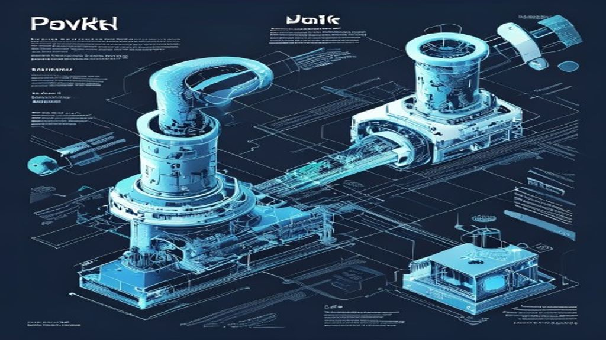

By 2026, the landscape of deep learning frameworks has shifted from a "choose one" mentality to a highly nuanced ecosystem where PyTorch and JAX serve distinct, albeit overlapping, architectural philosophies. While PyTorch has cemented itself as the industry workhorse for production and deployment, JAX has become the high-performance research engine of choice.

If you are starting a new project this year, the choice shouldn't be about which framework is "better," but rather which matches your deployment pipeline and mathematical requirements.

## PyTorch: The Production Gold Standard
PyTorch remains the de-facto language of artificial intelligence. In 2026, the framework has moved far beyond its "dynamic graph" origins. With the mature integration of `torch.compile` and the continued dominance of the Hugging Face ecosystem, PyTorch is the path of least resistance for almost any application.

The primary advantage of PyTorch today is its "batteries-included" nature. If you are building a multimodal agent or deploying a transformer-based application to a cloud environment, you will find 99% of your dependencies already natively supported. The transition from local prototyping to `torch.export` (the new standard for AOT—Ahead of Time—compilation) is smoother than ever, allowing engineers to move models into C++ environments or mobile hardware without the friction that defined the 2022-2023 era.

## JAX: When Performance is the Only Variable
While PyTorch is for the masses, JAX is for the mad scientists and the hardware-constrained. JAX is essentially NumPy for the modern accelerator, built on top of XLA (Accelerated Linear Algebra). By 2026, the barrier to entry for JAX—which used to be its rigid functional programming paradigm—has been lowered by libraries like Equinox and Flax.

You should choose JAX if your workflow involves:
*   **Massive Model Parallelism:** JAX’s `sharding` and `pjit` APIs remain the gold standard for training models across thousands of TPUs or GPUs.
*   **Custom Gradient Calculations:** If you are doing scientific computing, physics-informed neural networks (PINNs), or complex differentiable simulations, JAX’s `vmap` (vectorization) and `grad` transformations are mathematically superior to the object-oriented approach in PyTorch.
*   **Pure Research:** When you need to iterate on a new mathematical architecture where "standard" layers aren't enough, JAX’s functional style forces a clean separation of state and computation that prevents the "spaghetti code" common in large PyTorch projects.

## The Developer Experience Gap
The biggest divide in 2026 is the developer experience. PyTorch feels like *software engineering*; it embraces object-oriented patterns, classes, and mutable states. It is incredibly easy to debug using standard Python tools. When something goes wrong in a PyTorch model, you can usually drop in a print statement or a standard debugger and see exactly where the tensor values went off the rails.

JAX, conversely, feels like *mathematical composition*. Because it enforces functional purity, you cannot easily mutate state. This can be jarring for developers used to PyTorch or TensorFlow. However, once you embrace the transformation-first approach—where you define a pure function and then transform it using `jit`, `grad`, or `vmap`—you gain a level of code reusability that PyTorch struggles to match.

## Summary Checklist: Making Your Choice
To decide for your 2026 projects, refer to this breakdown:

*   **Choose PyTorch if:**
    *   You need to deploy to mobile, edge devices, or standard enterprise cloud infrastructure.
    *   You are building on top of existing models (LLMs, Diffusion, Vision) found on Model Hubs.
    *   Your team prefers object-oriented patterns and standard Python debugging.
*   **Choose JAX if:**
    *   You are conducting research on entirely new architectures.
    *   You are working in scientific computing, fluid dynamics, or complex simulations.
    *   You have access to large-scale TPU clusters or require highly custom distributed training configurations.

### Final Verdict
The "winner" of the framework war is ultimately the one that helps you ship faster. In 2026, PyTorch has won the battle for the enterprise, making it the safest default for most professional settings. However, JAX has successfully carved out a permanent, critical niche as the framework for high-performance innovation. If you want to be a versatile engineer, learning the functional patterns of JAX will actually make you a better PyTorch developer, as it forces you to think more critically about the data flow and the mathematical structure of your models.
