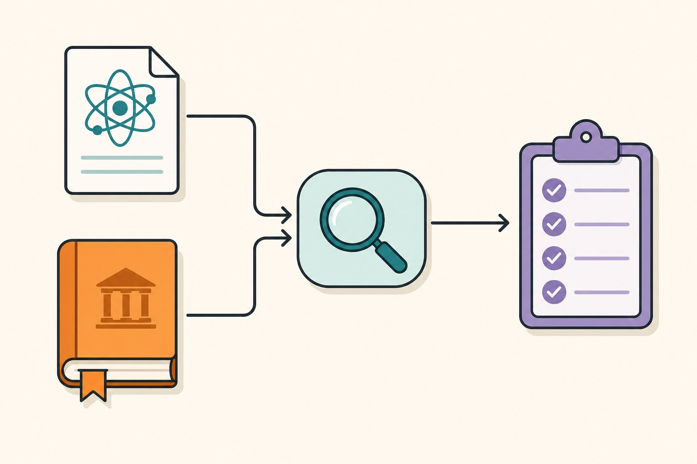

I do not work at an AI lab. I am an algorithm developer who uses machine learning as a tool, which means I cannot afford to spend hours a day following the field — but I also cannot afford to miss a change that breaks my pipeline or an optimization that would halve my inference time. What follows is the reading habit I converged on after realizing that most of my "AI news" time was being wasted on secondhand summaries of things I could have read directly.

The pace of development in artificial intelligence often feels like trying to drink from a firehose. For developers, researchers, and tech enthusiasts, the challenge isn’t just finding information—it’s filtering through the noise to distinguish between meaningful architectural shifts and marketing hype. Staying informed requires a disciplined approach to consuming primary sources rather than relying on secondary commentary.

## Shift Your Focus to Primary Documentation

The most reliable way to understand where AI is heading is to monitor the technical output of the organizations defining the field. Instead of reading summarized headlines, developers should look directly at the primary release notes, technical reports, and documentation provided by organizations like OpenAI, Google DeepMind, Anthropic, and the research organizations publishing technical papers on arXiv.

Official documentation is where you find the authoritative information about a model's capabilities and its limitations. When a research lab releases a new architecture, they typically accompany it with a technical report detailing the training data composition, the model’s evaluation methodology, and the specific benchmarks used to validate its performance. By reading these papers, you bypass the inaccuracies that often creep into third-party reporting. If you want to know if a model supports function calling, context window extensions, or specific multimodal inputs, the API documentation is the only source that matters.

## Prioritize Architectural Patterns over Hype

The industry is moving beyond the simple "chat interface" paradigm. To stay ahead, pay close attention to architectural trends documented in academic literature and developer forums hosted by major platform providers. Current trends indicate a significant shift toward agentic workflows—systems where the AI is not merely responding to a single prompt, but is capable of iterative planning, tool usage, and self-correction.

When evaluating a new development tool or framework, look for its structural impact on your stack. Is it introducing a new abstraction for Retrieval-Augmented Generation (RAG)? Does it change how latency is handled in long-context sequences? By focusing on the *mechanics* of the software—how it manages state, handles memory, and interfaces with external databases—you can predict whether a new trend will provide lasting value to your infrastructure or if it is a temporary novelty. 

## Curate Your Information Diet

To avoid being overwhelmed, you must be selective about where you allocate your time. Relying on social media feeds for technical updates is inefficient and often misleading. Instead, consider these high-signal practices:

*   **Follow Official Repositories:** Keep a watch list of core repositories on platforms like GitHub where foundational libraries are updated. Observing the commit history and pull requests can reveal upcoming features before they are officially announced in marketing materials.
*   **Monitor Standards Bodies and Consortia:** Organizations like the Partnership on AI or academic workshops at conferences like NeurIPS and ICML provide a long-term view of where the field is heading regarding safety, policy, and infrastructure standards.
*   **Utilize Official Change Logs:** Make it a habit to check the "What's New" or "Changelog" pages of your primary AI tool providers once a week. These pages are concise, factual, and strictly focused on what has been deployed to production.

## Recognizing the Limits of Current Trends

It is essential to maintain a healthy skepticism toward "revolutionary" claims. History in software development teaches us that infrastructure transitions are gradual. While a new architecture might be capable of impressive feats, its actual utility in your specific stack is determined by your integration requirements and the stability of the provider’s infrastructure. 

Always look for the "known limitations" section in any technical report. The most sophisticated AI developers are the ones who understand where a system fails, not just where it excels. By understanding these edge cases, you are better equipped to build robust, fault-tolerant systems that can withstand the inevitable iterations and updates that characterize the current AI landscape.

Keeping up with AI is not about memorizing every new release. It is about understanding the underlying architecture and maintaining a consistent connection to the primary sources of technical truth. By focusing on documentation and structural patterns, you can cut through the noise and build systems that are truly grounded in reality.
