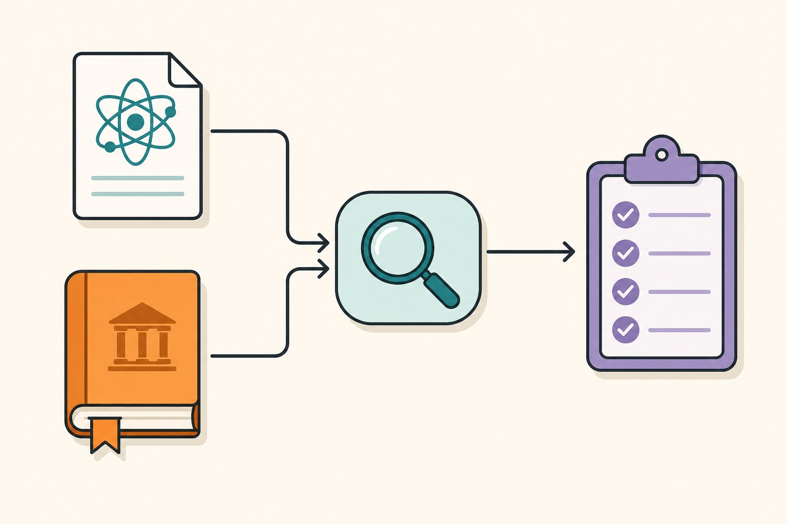

I do not work at an AI lab. I am an algorithm developer who uses machine learning as a tool, which means I cannot afford to spend hours a day following the field — but I also cannot afford to miss a change that breaks my pipeline or an optimization that would halve my inference time. What follows is the reading habit I converged on after realizing that most of my "AI news" time was being wasted on secondhand summaries of things I could have read directly.

And I should admit up front why I feel strongly about this: this blog has already paid the price of *not* doing it. An early version of [my CUDA/cuDNN setup post](/posts/optimizing-deep-learning-cuda-cudnn-setup) contained installation instructions I wrote partly from memory — the `.tgz` tarball name, the old extract-and-copy procedure. When I later checked NVIDIA's current install guide line by line, several details had quietly changed: cuDNN 9.x ships as `.tar.xz`, the recommended copy procedure is different, and CUDA samples haven't been bundled with the installer since 11.6. Nothing announced that. The secondary sources I had absorbed over the years were describing a world that no longer existed, and I republished their lag under my own name. That correction is what turned "read primary sources" from advice I nodded at into a habit I actually keep.

## Docs and release notes outrank commentary — because they have to be right

The asymmetry is simple: a blogger summarizing a release pays no cost for being subtly wrong; the vendor's documentation is load-bearing. When I needed to know whether a specific operator could be exported to ONNX, the answer wasn't in any tutorial — it was in the exporter's own error text and the PyTorch GitHub issues around it, which led to [an afternoon of testing both exporters](/posts/what-actually-breaks-exporting-pytorch-to-onnx) and finding that the newer one handled what the older one refused. Tutorials describe the API of one moment, frozen at their publication date. Release notes describe the deltas, which is what you actually need once you're past the beginner stage.

So my first filter for any claim that matters to my work is: can I trace it to a release note, an official doc page, a technical report, or the source code? If not, it goes in the "interesting, unverified" pile, and nothing from that pile is allowed to change my pipeline.

## Read for mechanics, not verdicts

The second habit: when a new architecture or pattern gets loud — agents, RAG variants, a new attention mechanism — I skip the takes and look for the mechanical description. What state does it keep? What does it retrieve, when, and how does the context get assembled? What are the failure modes the authors themselves list? A RAG system, mechanically, is a retrieval index, a ranking step, and a context assembly policy; once you see it at that level, you can predict which claims about it are plausible for *your* data without waiting for someone else's benchmark.

Technical reports make this easier than their reputation suggests, because the most honest section of any paper is "limitations" — the authors telling you, under their own names, where the thing breaks. I read that section before the results section now. A report with a thin or evasive limitations section tells you something too.

## The actual weekly loop

Concretely, my recurring diet is small enough to sustain:

- **Release notes and changelogs, weekly.** PyTorch, CUDA/cuDNN, onnxruntime, and the API providers I depend on. Fifteen minutes; these pages are terse, factual, and describe only what shipped. This is the single highest-yield slot in the loop — it's where I'd have caught the cuDNN packaging change before publishing it wrong.
- **Repository watch, passive.** Issues and pull requests on the handful of libraries where my pipeline lives. PRs show you features before the marketing does, and issue threads show failure modes before the docs admit them. The `dynamo=True` ONNX exporter behavior I tested was discussed in GitHub issues long before it was well-documented anywhere else.
- **Papers, on demand rather than on schedule.** I don't scan arXiv daily; I read a technical report when a specific decision depends on it, and I read it methods-and-limitations first. Depth over recency — a paper skimmed for its abstract is a secondhand source you produced yourself.

## Skepticism as a scheduling policy

None of this requires unusual discipline once you accept the underlying premise: "revolutionary" claims are cheap, and infrastructure transitions are slow. Whatever is genuinely important will still be important in two weeks, at which point it will have documentation, reported issues, and a limitations section — all far better decision inputs than launch-day commentary. The things that actually bite on a normal Tuesday are the quiet ones: a changed archive format, a deprecated flag, an exporter whose coverage silently differs from its predecessor. Those never trend. They only appear in the primary record, which is why the primary record is what I read.

Keeping up with AI, for a working engineer, is not about ingesting more — it's about ingesting closer to the source. Fewer items, higher trust, and a standing rule that nothing changes in my stack on the strength of a summary alone. I've been burned by exactly one kind of source so far, and it wasn't the documentation.
