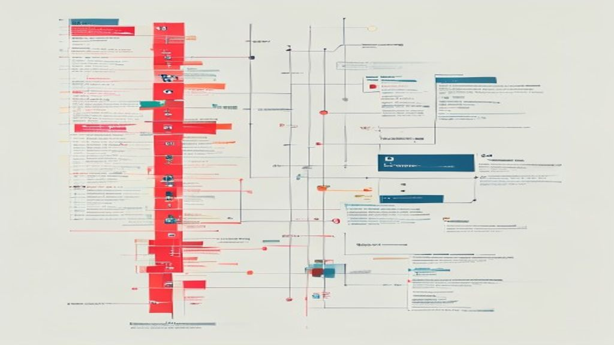
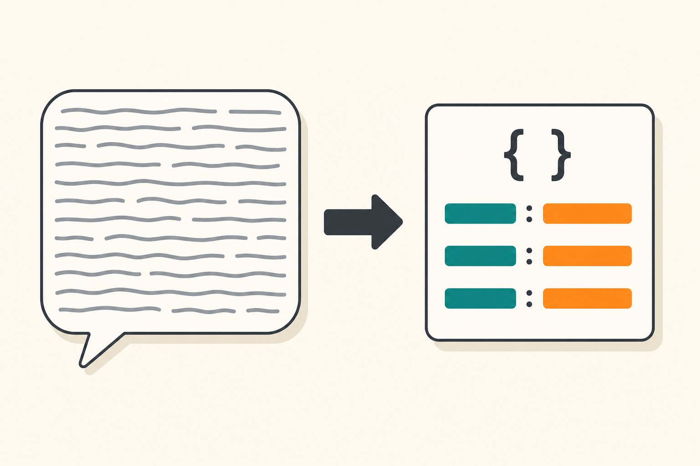

I learned token efficiency the involuntary way: by building side-project tooling against free-tier API quotas, where a wasteful prompt does not just cost money — it locks you out for the rest of the day. That constraint turned out to be a great teacher. Every pattern below came from having to make a fixed daily budget of tokens do real work, and all of them transfer directly to paid tiers, where the same discipline shows up as a smaller invoice and lower latency.

In the current landscape of Large Language Models (LLMs), the cost and latency associated with token consumption are the primary bottlenecks for developers. Whether you are building an internal tool or a customer-facing application, the way you structure your interactions with these models dictates both your monthly expenditure and the quality of the user experience. Optimizing for token efficiency is not just about saving money; it is about architectural hygiene.

## Refine Your System Prompts for Conciseness

The system prompt sets the behavior and constraints for the model. Because these instructions are included in every request—and often re-sent in every turn of a conversation—they are a major driver of token costs. Developers often fall into the trap of writing verbose, conversational system prompts that repeat instructions unnecessarily.

To optimize, treat your system prompt like a function definition in code. Use imperative, sparse language. Instead of writing, "I would like you to act as a helpful assistant that summarizes text," simply state, "Task: Summarize the provided text." Official documentation for most major AI providers emphasizes that models respond well to structured, clear constraints. By reducing "fluff," you lower the baseline tokens consumed by every API call, which compounds significantly as your application scales.

## Leverage Few-Shot Prompting and RAG Effectively

Few-shot prompting—providing a few examples of input/output pairs—can significantly improve model performance. However, if your examples are excessively long, you are effectively paying for those tokens every time you make a call. To maintain efficiency:

*   **Curate Examples:** Use the shortest possible examples that still demonstrate the required pattern.
*   **Use Retrieval-Augmented Generation (RAG):** Instead of stuffing your prompt with a massive knowledge base, use a vector database to retrieve only the most relevant snippets of information. 
*   **Limit Context Window:** Only pass the specific pieces of data that the model needs to answer the immediate prompt. 

By offloading your long-term storage to a database and only calling upon it when necessary, you avoid the cost of sending the entire document library in every single context window. This architecture ensures that your "context" remains thin and relevant.

## Implement Output Parsers and Structured Formats

One of the most common sources of "hidden" token waste is output formatting. If you ask a model to "write a report," it may generate thousands of tokens of conversational filler, headers, and disclaimers. If you only need a specific piece of data, such as a sentiment score or a categorization tag, you are wasting tokens on the prose surrounding that data.

Using structured output formats—such as JSON or specific schema definitions—can force the model to provide only the information you need. Many API providers offer specific parameters or "modes" that restrict the model's output to valid JSON or specific enumerations. By constraining the model to a schema, you drastically reduce the length of the response, keeping the model focused on the requested data payload rather than creative writing.

One pattern I ended up relying on: split generation into two calls instead of demanding one giant structured response. In my own pipeline, I first ask for the long free-form content, then make a second, much smaller call that extracts just the metadata (title, tags, summary) as JSON. Smaller models frequently mangle a big combined "content + metadata" JSON schema, and one malformed response means regenerating *everything* — burning far more tokens than the extra call costs. Two focused requests proved both cheaper and more reliable than one fragile mega-prompt.

## Monitor and Iterate Based on Usage Data

Optimization is an iterative process. You cannot manage what you do not measure. Use the logging and telemetry tools provided by your API platform to monitor token usage per request. Look for outliers where specific users or processes are triggering disproportionately large contexts.

If you find that your prompts are consistently hitting high token counts, consider whether you can break the task into smaller, sequential steps (a technique sometimes called "chain-of-thought" or multi-step prompting). While this uses more API calls, the individual calls themselves remain small and efficient, often leading to better reliability and lower overall costs than a single, bloated request.

## Conclusion

Optimizing for token efficiency is a balancing act between model performance and infrastructure cost. By tightening your system prompts, utilizing RAG to limit context, and enforcing structured outputs, you create a lean pipeline that performs better at a lower cost. As you refine these processes, focus on clear, programmatic instructions over conversational ones. Efficiency in AI isn't just about cutting corners; it is about building robust, predictable systems that maximize every token spent.
