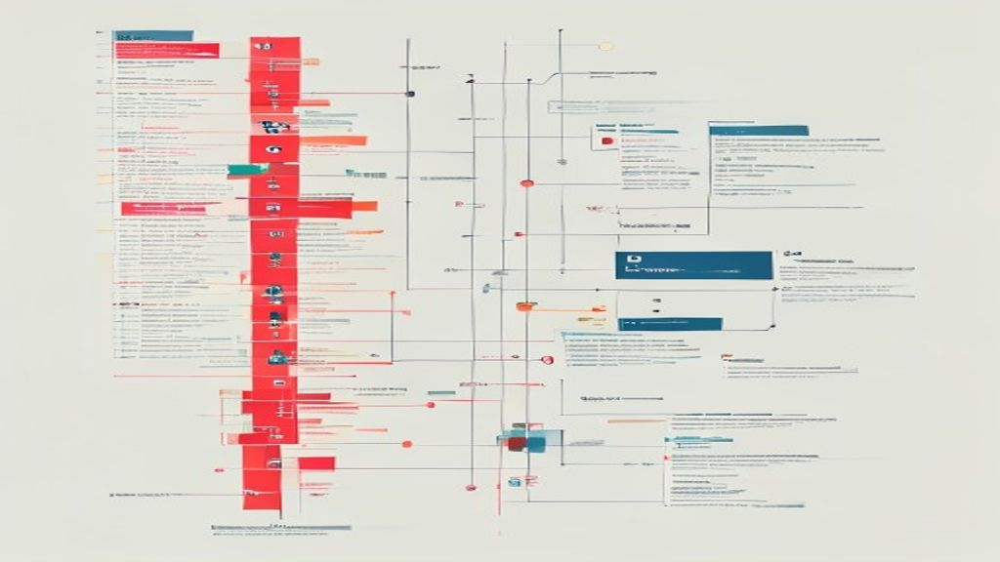
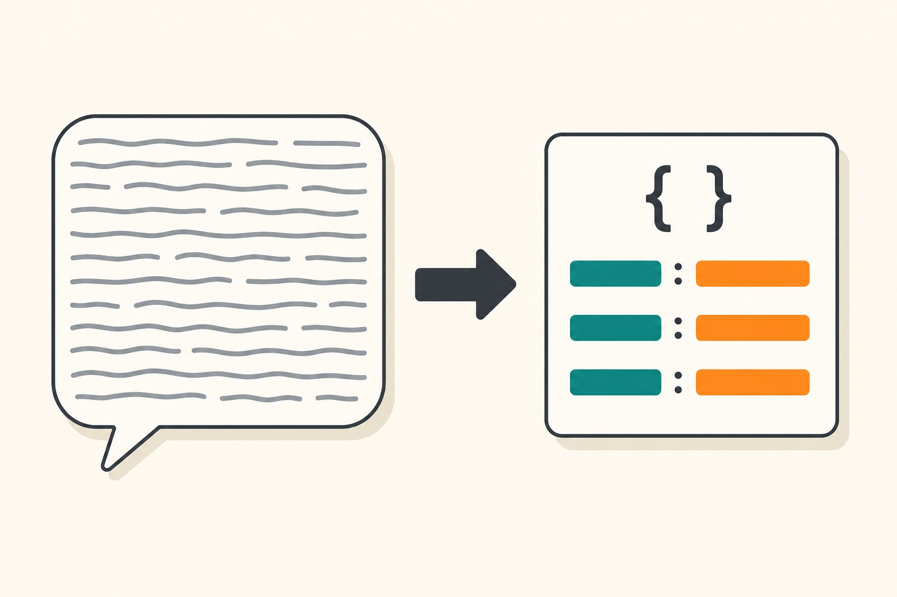

I learned token efficiency the involuntary way: by building side-project tooling against free-tier API quotas, where a wasteful prompt does not just cost money — it locks you out for the rest of the day. That constraint turned out to be a great teacher. Every pattern below came from having to make a fixed daily budget of tokens do real work, and since advice about "concise prompts" is usually given without a single number attached, I ran my own prompts through a tokenizer before writing this so you can see what the patterns are actually worth.

The measuring tool is free and takes one line — `tiktoken` with the `o200k_base` encoding that current OpenAI models use:

```python
import tiktoken
enc = tiktoken.get_encoding("o200k_base")
print(len(enc.encode(my_system_prompt)))
```

If you take nothing else from this post: run that on your own system prompt. Mine was embarrassing the first time.

## The system prompt: my 79-token apology

Here is a system prompt very close to the first one I ever shipped, the kind that reads like an email to a colleague — "I would like you to act as a helpful and professional assistant that specializes in summarizing text documents… please make sure the summary is accurate and well-written… thank you very much for your help!" Tokenized: **79 tokens**. The version I use now says the same thing in the register of a function signature — "Task: Summarize the document. Rules: key points only; no information not in the source." Tokenized: **21 tokens**.

That's a 3.8x difference on text that is re-sent with *every single call*, and in multi-turn conversations, with every turn. At a modest 2,000 calls a day, the polite version costs 158,000 tokens daily against the terse version's 42,000 — the difference bought me nothing, because the model does not need to be thanked. Models respond to structure, not courtesy. The mental shift that helped me: a system prompt is not a message, it's a config file.



## Few-shot examples are a subscription, not a purchase

Few-shot examples earn their tokens when they demonstrate a *pattern* the model would otherwise miss — but every token in an example is billed on every call, forever. One of my sentiment-extraction examples originally used a realistic five-line product review as its input: 72 tokens. Trimming the input to the two clauses that actually carried the signal ("Battery dies in 3 hours. Screen is nice.") preserved the demonstrated pattern at 30 tokens. Multiply that saving by three examples and every call in the pipeline's lifetime.

The same discipline applies at larger scale to RAG. Retrieval exists precisely so you don't ship your whole knowledge base in the context window — but the default failure mode is retrieving too much "just in case." Every chunk you append is paid for in tokens *and* in the model's attention. My rule from quota days: start with fewer retrieved chunks than feels safe, and only raise the count when you can point to actual failures caused by missing context. I have found missing-context failures to be loud and easy to diagnose; bloated-context costs are silent and permanent.


## Output tokens: the ones you pay for twice

Output tokens cost more than input tokens on most pricing pages, and they also cost latency — generation is sequential, so a response twice as long takes roughly twice as long to stream. Which makes conversational filler expensive. I tokenized a typical "helpful" answer to a sentiment-classification request — the kind that opens with "Sure! I analyzed the review you provided…" and closes with an offer to analyze more reviews, with the actual JSON sandwiched in the middle: **83 tokens**, of which the JSON payload is **27**. Two-thirds of the response was wrapping paper. Constrained output modes (JSON mode, schema-enforced responses) exist to strip exactly that, and they also remove the fragile regex step where you fish the JSON out of the prose.

One hard-won pattern here: split generation into two calls instead of demanding one giant structured response. In my own pipeline, I first ask for the long free-form content, then make a second, much smaller call that extracts just the metadata (title, tags, summary) as JSON. Smaller models frequently mangle a big combined "content + metadata" JSON schema, and one malformed response means regenerating *everything* — burning far more tokens than the extra call costs. Two focused requests proved both cheaper and more reliable than one fragile mega-prompt.



## Measure your own pipeline, not mine

The numbers above are from my prompts and one tokenizer; yours will differ, which is exactly why the tokenizer one-liner matters more than any of my specific counts. Two habits that survived after the quota pressure was gone: I log token usage per request type (not just the monthly total — the total hides which *pattern* is expensive), and when a prompt's count creeps up, I check whether the task should be split into smaller sequential calls. More calls with small, focused contexts have repeatedly beaten one bloated request for me, on cost and on reliability both.

None of this is exotic engineering. It's the same instinct as profiling before optimizing — [the way I approach GPU pipelines](/posts/optimizing-pytorch-deep-learning-pipelines) applies to API budgets too: measure first, and the waste usually announces itself. My waste was 58 tokens of politeness on every call. Find yours.
