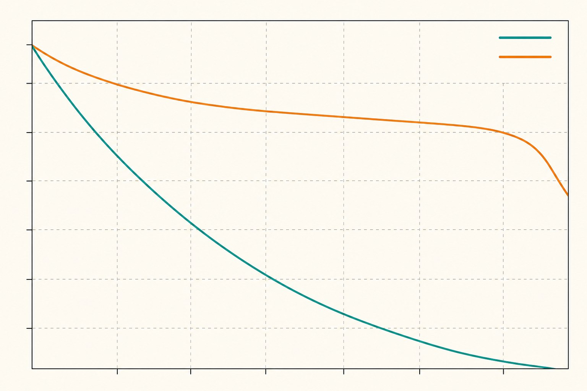

This topic is my day job. I develop algorithms for IMU sensors and image processing, and the models I work with ultimately have to run on embedded targets — not on the workstation GPU where they were trained. The gap between "the model works in the notebook" and "the model runs within the device's power and latency budget" is where quantization stops being a textbook topic and becomes a series of very concrete engineering decisions.

Deploying deep learning models to edge devices—such as mobile phones, microcontrollers, or embedded vision systems—presents a fundamental conflict: heavy neural networks require significant compute and memory, while edge hardware is constrained by thermal limits, battery life, and silicon area. Quantization is the primary engineering bridge across this gap. By reducing the numerical precision of weights and activations, we can drastically shrink model footprints and accelerate inference on specialized hardware.

## Understanding the Precision Trade-off

At its core, quantization maps high-precision floating-point numbers (typically FP32) to lower-precision integers (INT8 or even lower). This process is governed by the affine quantization equation, which relies on a scaling factor and a zero-point to map the range of the floating-point values into the finite set of integer values. 

The primary challenge in this transition is maintaining accuracy. As you reduce precision, you effectively introduce quantization noise—the difference between the original floating-point value and its quantized integer counterpart. While modern hardware accelerators often feature dedicated integer matrix multiplication units (INT8 MACs) that provide significant performance gains, a poorly quantized model can see its predictive accuracy collapse. 

## Post-Training Quantization (PTQ) vs. Quantization-Aware Training (QAT)

Engineers generally choose between two primary workflows for model quantization:

*   **Post-Training Quantization (PTQ):** This approach applies quantization to a pre-trained floating-point model. It is typically fast and requires minimal data, often using a small "calibration" dataset to determine the optimal scaling factors for activations.
*   **Quantization-Aware Training (QAT):** This method simulates quantization effects during the training process. By allowing the model to adapt its weights to the noise introduced by precision loss, QAT often yields higher accuracy than PTQ, especially for low-bit architectures (such as 4-bit or 2-bit models).

My practical rule: always try PTQ first, but budget for QAT before you promise anyone a delivery date. PTQ takes an afternoon and tells you immediately whether your model is quantization-friendly. When it is not — and vision models with unusual activation distributions are frequent offenders — the accuracy drop shows up concentrated in exactly the edge cases you care about, and no amount of calibration data fixes it. That is the signal to switch to QAT rather than keep tuning PTQ parameters.

Another lesson from practice: make the calibration dataset look like *deployment* data, not training data. A model calibrated on clean, well-lit training images can quantize poorly for the noisy, low-light frames the device will actually see, because the activation ranges chosen during calibration do not cover the real distribution.

## Hardware-Specific Constraints and Memory Alignment

When deploying to edge devices, the theoretical speedup of quantization is often gated by hardware-specific implementations. Many neural processing units (NPUs) or digital signal processors (DSPs) require data to be aligned in specific memory layouts—such as NCHW or NHWC formats—to maximize throughput. 

Beyond memory alignment, quantization strategies must account for the underlying hardware's supported bit-widths. While INT8 is the industry standard for general-purpose inference, some specialized hardware accelerators offer native support for sub-8-bit precision (like INT4 or INT2). Utilizing these formats requires careful handling of per-channel or per-tensor quantization, as rounding errors can aggregate rapidly across deep network layers. Referencing the technical reference manual for your specific target silicon is essential to determine whether it supports symmetric or asymmetric quantization, as this affects the computational overhead of the de-quantization step during runtime.

## Balancing Latency and Model Density

Choosing the right strategy involves a continuous assessment of the "efficiency frontier." As you move toward lower precision, you may observe:

1.  **Memory Bandwidth Reduction:** Significant decreases in the amount of data transferred from DRAM to the processing core.
2.  **Increased Throughput:** Higher operations-per-second enabled by smaller integer-based math.
3.  **Accuracy Degradation:** A potential drop in top-1 or top-5 performance depending on the sensitivity of the specific model architecture.

For deployment, it is often useful to perform a "sensitivity analysis." By quantizing individual layers one at a time and measuring the resulting accuracy drop, you can identify which layers are most sensitive to bit-depth reduction. These layers can be kept at higher precision (e.g., INT16 or FP16), while less sensitive layers are compressed to INT8, a technique often referred to as mixed-precision quantization.

## Conclusion

Quantization is not a one-size-fits-all optimization; it is a design choice that must be balanced against the specific requirements of the edge hardware. By utilizing established techniques like PTQ for rapid deployment and QAT for maximum accuracy, developers can successfully shrink models to fit within the constraints of edge silicon. As the industry continues to refine these techniques, the focus remains on standardizing the bridge between high-level machine learning frameworks and the low-level hardware constraints of the edge. Always consult your hardware vendor’s documentation to ensure your quantization strategy aligns with the specific capabilities of your target device.
