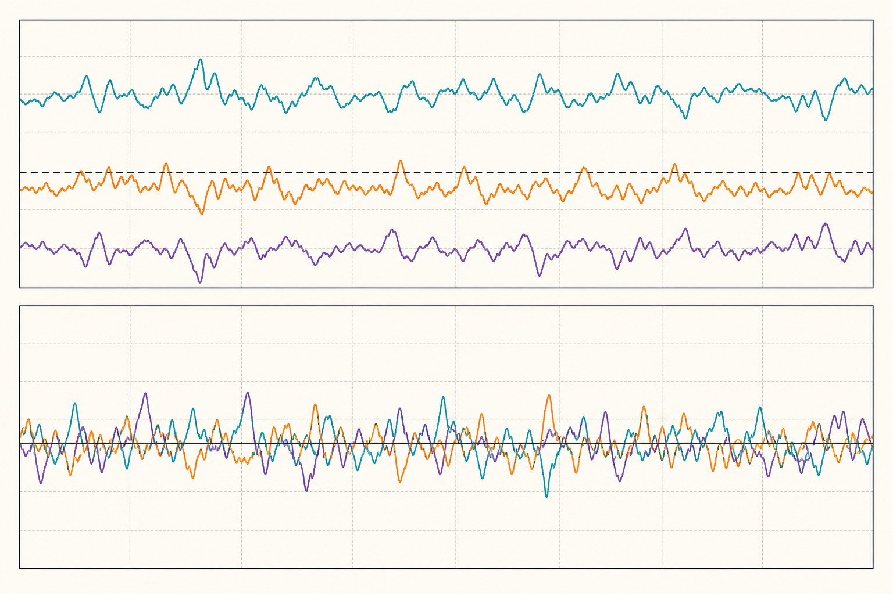
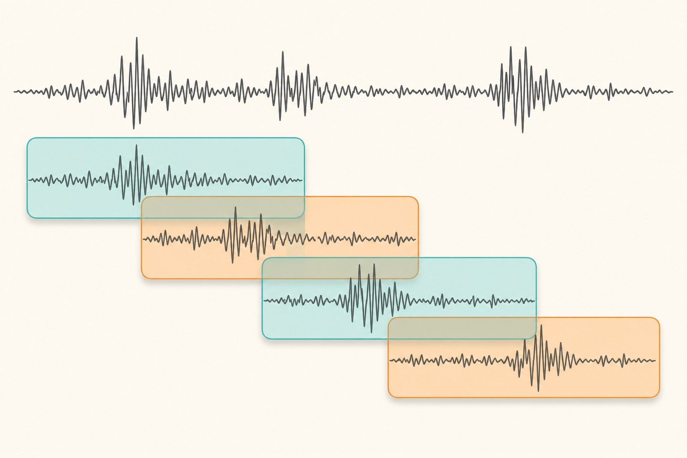

Most of what I know about feeding IMU data into neural networks, I learned by watching models fail. Not fail loudly — fail *politely*, with a validation accuracy that looked respectable and then fell apart the moment the model saw data from a device it hadn't been trained on. In nearly every case the problem wasn't the architecture. It was something upstream, in the twenty lines of preprocessing code everyone writes in five minutes and never looks at again.

Working with inertial sensors is my day job, so this post is the checklist I wish I could hand to every ML engineer who picks up an IMU dataset for the first time. None of it is exotic. All of it has bitten me at least once.

## First, know what the sensor is actually measuring

An accelerometer at rest does not read zero. It reads gravity — a device lying flat on a table reports roughly 9.81 m/s² on one axis. If you feed raw accelerometer values into a model expecting "motion", the largest component of your signal is actually orientation information in disguise. That's not necessarily bad (orientation is often useful), but you should decide *deliberately* whether gravity stays in, gets subtracted, or becomes its own input channel, rather than let the default happen to you.

The gyroscope has its own trap: units. Some drivers report rad/s, others deg/s, and the difference is a factor of about 57. A model will happily train on either — it will even train on a dataset where half the devices report one and half the other, which is exactly the kind of thing that produces a mysterious per-device accuracy gap months later. Print the value ranges of every channel from every device before you do anything else. It takes two minutes and it has saved me more debugging time than any profiler.



## Timestamps are part of the data

Datasets tend to advertise a sampling rate — "100 Hz" — and ML pipelines tend to take that at face value, treating the recording as a perfectly uniform sequence. Real logs from real devices are messier. Consumer hardware delivers samples with jitter, occasional gaps where the OS deprioritized the sensor service, and sometimes bursts of duplicated timestamps. If you ignore this and window by sample count, two "2-second" windows can cover meaningfully different amounts of real time.

My habit is to resample everything onto a uniform time grid before any other step, using simple linear interpolation per channel:

```python
import numpy as np

def resample_uniform(t, x, rate_hz):
    """t: (N,) timestamps in seconds, x: (N, C) samples."""
    t_new = np.arange(t[0], t[-1], 1.0 / rate_hz)
    return t_new, np.stack(
        [np.interp(t_new, t, x[:, c]) for c in range(x.shape[1])], axis=1
    )
```

Linear interpolation is not fancy, and for large gaps it produces suspiciously straight lines — I prefer to detect gaps beyond a few sample periods and split the recording there instead of interpolating across them. A model trained on interpolated flat-lines learns that flat-lines are normal.

One more thing while you're here: if you downsample (say, 200 Hz logs to a 50 Hz model input), low-pass filter first. Skipping the anti-aliasing step folds high-frequency content down into your band, and vibration — machinery, footsteps, a shaky mount — lives exactly in the frequencies you're folding.

## Gravity: subtract it, keep it, or split it

There are three defensible options for the gravity component, and I've shipped all three at different times:

*   **Keep it.** Simplest, and often fine — gravity encodes device orientation, which for activity recognition is genuinely informative (a phone in a pocket sits differently than one in a hand).
*   **Remove it.** Estimate the gravity vector with a low-pass filter (a cutoff somewhere around 0.3 Hz is a common starting point) and subtract it, leaving linear acceleration. Useful when orientation is a nuisance variable you want the model to ignore.
*   **Split it.** Feed both the low-passed gravity estimate and the residual as separate channels. Costs you channels, but the model no longer has to spend capacity doing the separation itself.

The wrong move is subtracting a *constant* per recording. Devices rotate during use; gravity moves between axes. A static subtraction leaves rotation artifacts that look like phantom accelerations.

## Windowing, and the leak nobody notices

Sequence models need fixed-length windows, and for human motion at 50 Hz, windows of one to three seconds with around 50% overlap are a reasonable default. The window length itself is rarely the problem. The problem is what overlap does to your evaluation.

Overlapping windows from the same recording are near-duplicates — 50% of their samples are literally shared. If you pool all windows and split train/validation randomly, you have placed near-copies of training data in your validation set, and your accuracy number is now measuring memorization. This is the single most common flaw I see in published IMU pipelines, and it's why results sometimes drop double digits when the model meets a new user.



Split at the highest level that matters for your deployment: by subject if the model must generalize to new people, at minimum by recording session. Windows are cut *after* the split, never before. The same logic applies to normalization — compute your per-channel mean and standard deviation on the training split only, then apply those statistics everywhere. Statistics computed over the full dataset are a quieter version of the same leak.

## Wiring it into PyTorch

Once the decisions above are made, the actual `Dataset` is boring — which is how it should be. The one design choice I'd argue for: do the resampling, filtering, and windowing offline, store the results, and keep `__getitem__` nearly free. IMU tensors are tiny compared to images; precomputing everything costs little disk and removes an entire category of CPU-bottleneck problems from training (a topic I covered in the [pipeline profiling post](/posts/optimizing-pytorch-deep-learning-pipelines)).

```python
import torch
from torch.utils.data import Dataset

class IMUWindows(Dataset):
    def __init__(self, windows, labels, mean, std):
        self.x = torch.as_tensor(windows, dtype=torch.float32)  # (N, T, C)
        self.y = torch.as_tensor(labels, dtype=torch.long)
        self.mean = torch.as_tensor(mean, dtype=torch.float32)  # (C,)
        self.std = torch.as_tensor(std, dtype=torch.float32)

    def __len__(self):
        return len(self.y)

    def __getitem__(self, i):
        return (self.x[i] - self.mean) / self.std, self.y[i]
```

If you augment, augment in ways the physics permits. Random rotations of the sensor frame are excellent — they simulate the device being mounted differently, which is exactly the variation you'll face in deployment. Time-warping and channel-swapping need more care: swapping the x and y axes of a gyroscope is not a label-preserving transform if your activity classes depend on direction of rotation.

## The short version

Print your units. Trust timestamps, not sample counts. Decide what to do with gravity instead of inheriting a default. Cut windows after splitting, not before, and normalize with training statistics only. None of this is glamorous, and none of it shows up in the model diagram — but in my experience it moves accuracy on *new devices and new users* far more than swapping in a fancier architecture. The network can only learn from what the pipeline hands it.
