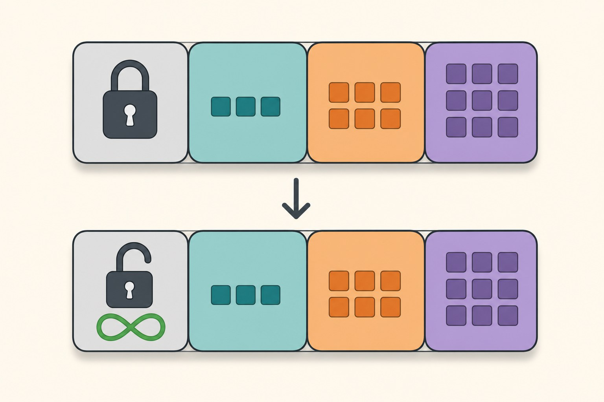
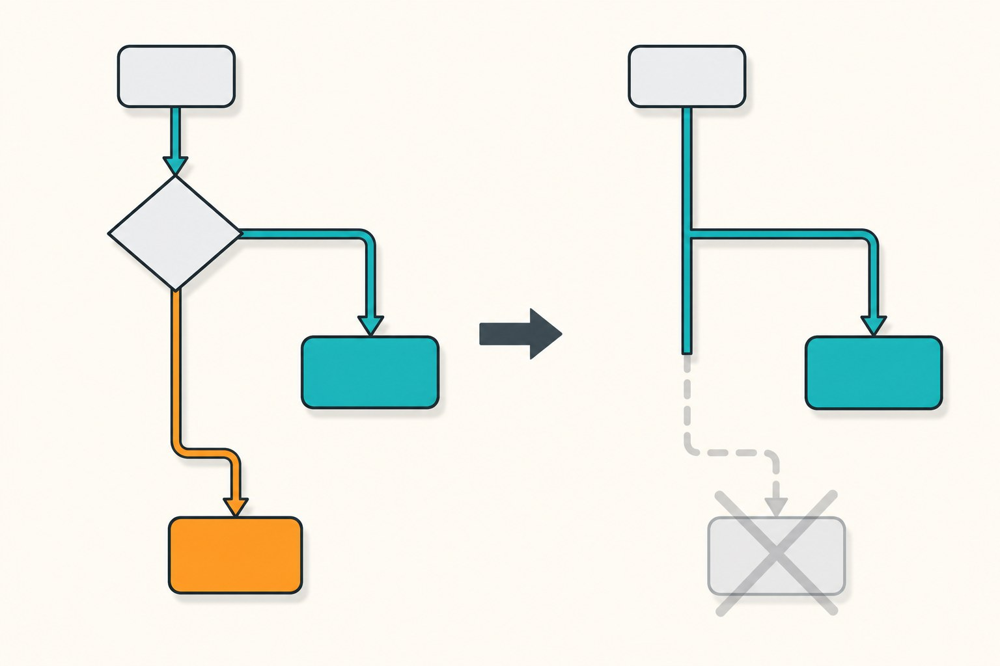

In my line of work, a model that only runs inside Python is half a deliverable. The vision models I build eventually have to run inside a C++ pipeline or on an embedded runtime, and ONNX is usually the bridge. The trouble with that bridge is its failure modes: some exports fail loudly, some fail *silently*, and the silent ones are the ones that reach production.

Everything below was reproduced on my machine while writing this post — PyTorch 2.6.0, onnxruntime 1.20, Windows — and every error message is pasted from a real run, not from memory. I picked the four failures I consider most instructive, roughly in the order you are likely to meet them.

## 1. Your batch size is frozen and nobody told you

The classic. `torch.onnx.export` traces the model with the example input you provide, and unless you say otherwise, **every input dimension becomes a hard constraint** — including the batch dimension you assumed was flexible.

```python
torch.onnx.export(model, torch.randn(1, 3, 32, 32), "model.onnx", opset_version=17)
```

Export succeeds. Unit test with batch size 1 passes. Then the serving code sends a batch of 8:

```text
[ONNXRuntimeError] : 2 : INVALID_ARGUMENT : Got invalid dimensions for input: input.1
 for the following indices
 index: 0 Got: 8 Expected: 1
```

The fix is the `dynamic_axes` argument, which marks specific dimensions as symbolic:

```python
torch.onnx.export(
    model, torch.randn(1, 3, 32, 32), "model.onnx", opset_version=17,
    input_names=["input"], output_names=["logits"],
    dynamic_axes={"input": {0: "batch"}, "logits": {0: "batch"}},
)
```

After this, the model's declared input shape becomes `['batch', 3, 32, 32]` and a batch of 8 runs fine — I verified both shapes with `session.get_inputs()`. My rule: decide *at export time* which dimensions vary in deployment (batch, sequence length, image size), and name all of them. Retrofitting dynamism after the model is in someone else's runtime is far more painful.



## 2. Python `if` statements are baked in, and the export won't stop you

This is the failure I consider genuinely dangerous, because nothing errors — you just ship a model that computes the wrong thing on part of its input space.

```python
class Branchy(nn.Module):
    def forward(self, x):
        if x.mean() > 0:
            return x * 2
        return x - 100
```

The tracer runs your `forward` once with the example input and records which operations executed. A Python `if` on tensor values is invisible to it — whichever branch the example input took becomes *the* model. I exported this with a positive example input, then fed a negative input to both:

```text
torch (negative input): [-101. -101. -101. -101.]
onnx  (negative input): [  -2.   -2.   -2.   -2.]
```

The ONNX model took the `x * 2` branch. Forever. PyTorch does emit a `TracerWarning` ("Converting a tensor to a Python boolean might cause the trace to be incorrect... this value will be treated as a constant"), but it's a warning in a wall of export logs, and the exported file is perfectly valid ONNX.



What surprised me: I expected the newer `dynamo=True` exporter to reject this model. It doesn't — it exports successfully and **bakes the same branch** (I checked: negative input still returns `-2`). If your model has data-dependent control flow, the honest options are restructuring it as tensor ops (`torch.where(x.mean() > 0, x * 2, x - 100)`) or accepting that the exported artifact implements one branch only.

## 3. Unsupported operators — and why you should try the new exporter before rewriting

Being in signal processing, my models sometimes contain an FFT. The legacy exporter wants nothing to do with it:

```text
UnsupportedOperatorError: Exporting the operator 'aten::fft_rfft' to ONNX opset
version 17 is not supported. Please feel free to request support or submit a
pull request on PyTorch GitHub.
```

Same result at opset 13. Historically, this is where you would rewrite the operation manually or split the model at the FFT boundary. But before doing that, it is worth one attempt with the newer exporter:

```python
torch.onnx.export(model, (example,), "model.onnx", dynamo=True)
```

On the exact same module, the `dynamo=True` path exported successfully (it decomposes to ONNX opset 18) and onnxruntime produced outputs matching PyTorch to within `2.9e-06`. One operator that was a hard wall in the legacy exporter simply worked in the new one. The two exporters are different programs with different coverage — treat "unsupported operator" as "unsupported by *this* exporter" until proven otherwise.

Two practical notes on `dynamo=True`: it requires the `onnxscript` package (you get a plain `ModuleNotFoundError` otherwise), and on Windows I hit something sillier — the export crashed with `UnicodeEncodeError: 'cp949' codec can't encode character '\u2705'`, because the exporter prints ✅/❌ progress emoji that a Korean-locale console cannot encode. Setting `PYTHONUTF8=1` fixed it. Somewhere out there another engineer on a non-UTF-8 locale is staring at that traceback; this paragraph is for you.

## 4. "Export succeeded" is not the finish line — measure the numbers

A conversion that runs without errors tells you the *graph* translated, not that the *math* survived. The check costs five lines, so I run it on every export:

```python
import numpy as np
import onnxruntime as ort

x = np.random.randn(8, 3, 32, 32).astype(np.float32)
with torch.no_grad():
    ref = model(torch.from_numpy(x)).numpy()

sess = ort.InferenceSession("model.onnx", providers=["CPUExecutionProvider"])
out = sess.run(None, {"input": x})[0]
print("max abs diff:", np.abs(ref - out).max())
```

For my small CNN the difference was `3.0e-08` — floating-point noise, all good. For the FFT model via the dynamo path it was `2.9e-06` — three orders larger, because the operator is implemented through a decomposition. Still fine for my purposes, but that is a judgment call, and you can only make it if you measured. Two habits worth keeping: compare on *real* preprocessed samples rather than only `randn` (data distribution can hit different code paths, as section 2 painfully shows), and record the tolerance you accepted next to the artifact.

## The checklist I actually use

Before an exported model leaves my machine: every varying dimension is listed in `dynamic_axes`; the export log is checked for `TracerWarning`s, each one explained or eliminated; the model has no data-dependent Python branching (or its fixed branch is documented); output parity against PyTorch is measured on real samples at more than one batch size. If the legacy exporter rejects an operator, one attempt with `dynamo=True` before any rewrite.

None of this appears in quick-start tutorials, and all of it came from exports that "succeeded". The conversion step deserves the same testing discipline as the model itself — especially when the next stop is [quantization for an edge target](/posts/optimizing-deep-learning-models-for-edge-via-quantization), where you will be glad to have a verified fp32 ONNX baseline to compare against.
