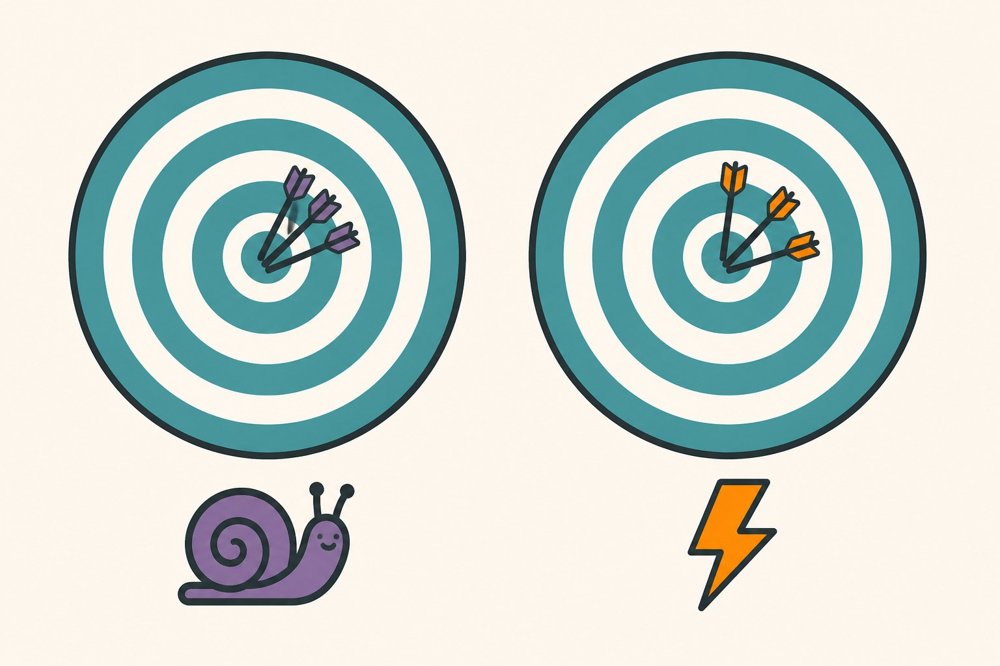
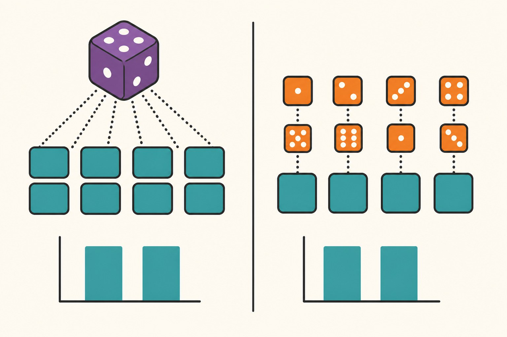

[My last post](/posts/gpu-image-augmentation-torchvision-v2) ended on an IOU: batched GPU augmentation was 13x faster than CPU workers, but every image in a batch silently shares the same random crop, jitter, and blur — and I didn't know whether that mattered for accuracy. "I'd rather measure it than guess in print," I wrote. This is the measurement.

The setup is deliberately small so I could afford repetition: CIFAR-10 restricted to 10,000 training images (a smaller training set amplifies augmentation effects, which is the phenomenon under test), a compact 6-conv-layer network with batch norm, 20 epochs of SGD with cosine decay, batch size 128, RTX 4080 Super. The augmentation recipe is the standard CIFAR trio — `RandomCrop(32, padding=4)`, horizontal flip, color jitter — applied three ways:

- **no-aug**: nothing, the control.
- **per-sample**: transforms inside `__getitem__`, one parameter draw per image. The textbook way.
- **per-batch**: raw batches to the GPU, transforms applied to the whole batch, one parameter draw per 128 images. The fast way, with the caveat under test.

Everything else — model init, data order, learning rate schedule — is identical, and each configuration ran with multiple random seeds. The per-batch training loop is two lines away from the normal one:

```python
for x, y in loader:              # raw uint8 batches
    x, y = x.cuda(), y.cuda()
    x = aug(x)                   # one dice roll per batch
    x = normalize(x)
    ...
```

One Windows footnote before the results, because this series apparently can't ship without one: my first run died with `RuntimeError: "nll_loss_forward_reduce_cuda_kernel_2d_index" not implemented for 'Int'`. CIFAR-10's labels come as a Python list; `np.array` on Windows defaults to int32, and `cross_entropy` wants int64. On Linux the same line would default to int64 and never crash. If your loss function complains about `'Int'` on Windows, append `.long()` and move on.

## Five seeds, and the wrong conclusion

Here is what the first five seeds said:

| Config (seeds 0–4) | test accuracy |
|---|---|
| no-aug | 76.84% ± 0.21 |
| per-sample | 78.37% ± 0.28 |
| per-batch | 78.03% ± 0.59 |

Two solid findings and one trap. Solid: augmentation works (+1.5 points over the control — this is why the training set is small), and per-batch clearly keeps most of the benefit. The trap: per-batch trails per-sample by 0.34 points, and I very nearly wrote that number down as "the cost of sharing parameters." It has everything a satisfying conclusion needs — it's small, it's plausible, and it confirms the worry that motivated the experiment.

But 0.34 points with those standard deviations and five runs per side is not a result; it's a coin flip wearing a lab coat. So I ran five more seeds of each augmented configuration:

| Config (seeds 5–9 only) | test accuracy |
|---|---|
| per-sample | 78.18% ± 0.33 |
| per-batch | 78.37% ± 0.30 |

The ordering *reversed*. The second batch of seeds says per-batch is better, with about the same margin the first batch used to say it was worse. Pooling all ten seeds per configuration:

| Config (10 seeds) | test accuracy | wall-clock per run |
|---|---|---|
| per-sample | 78.27% ± 0.32 | 53–71 s |
| per-batch | 78.20% ± 0.50 | **10 s** |

The difference is 0.07 percentage points. Seed-to-seed noise is 0.3 to 0.5 points. On this task, at this batch size, the shared-parameter penalty I set out to quantify is — as far as ten seeds can resolve — **zero**.



## The result hiding in the wall-clock column

Meanwhile, the column nobody was arguing about: per-batch runs finished in 10 seconds — *identical to training with no augmentation at all* — while per-sample runs took 53 to 71 seconds. The entire augmentation pipeline vanished from the budget. That's the [previous post's 13x microbenchmark](/posts/gpu-image-augmentation-torchvision-v2) surviving contact with a real training loop: end to end, the fast path trained six times faster while matching the textbook path's accuracy to within noise.

For an experiment-heavy workflow, that compounds brutally. Twenty-five training runs went into this post; on the per-sample pipeline they would have taken about half an hour, on the per-batch pipeline under five minutes. The 25-model experiment you actually run beats the statistically immaculate one you don't.

## What I am and am not claiming

I want to be precise here, because "it's fine" is exactly the kind of unqualified claim this blog exists to avoid. This experiment says: for a standard crop/flip/jitter recipe on a 10k-image CIFAR-10 subset at batch size 128, per-batch parameter sharing cost nothing detectable across ten seeds. It does not say the caveat never bites. Three regimes where I'd re-measure before trusting it: much larger batches (batch 1024 means one parameter draw per 1024 images — an 8x coarser dice roll than I tested), aggressive policies like RandAugment whose whole value is per-image diversity, and long training schedules where augmentation is the main regularizer. The per-batch variance also ran higher in my data (±0.50 vs. ±0.32) — plausible as a real effect of coarser randomness, but ten seeds can't separate it from luck, and I'm not going to pretend otherwise.



The quieter lesson is the one from the middle of the post: my first five seeds produced a clean, publishable, *wrong* ordering. Nothing about the setup was sloppy — same code, same data, honest averaging — and it still head-faked me, because a 0.3-point effect simply cannot be resolved with five samples of 0.3-to-0.6-point noise. If a blog post (including mine) reports a small accuracy difference from a handful of runs without spreads, treat it as an anecdote. The cheap fix is the one this post's speedup happens to buy: when each run costs 10 seconds, there is no excuse not to run ten of them.

So the [gotcha from last week](/posts/gpu-image-augmentation-torchvision-v2) gets its verdict, at least for my workloads: real mechanism, unmeasurable damage, and the fast path is now my default for image experiments. The dice are loaded per batch — it turns out the model doesn't care nearly as much as I feared. Measure it on the augmentation policy you actually use before you take my word for it.
