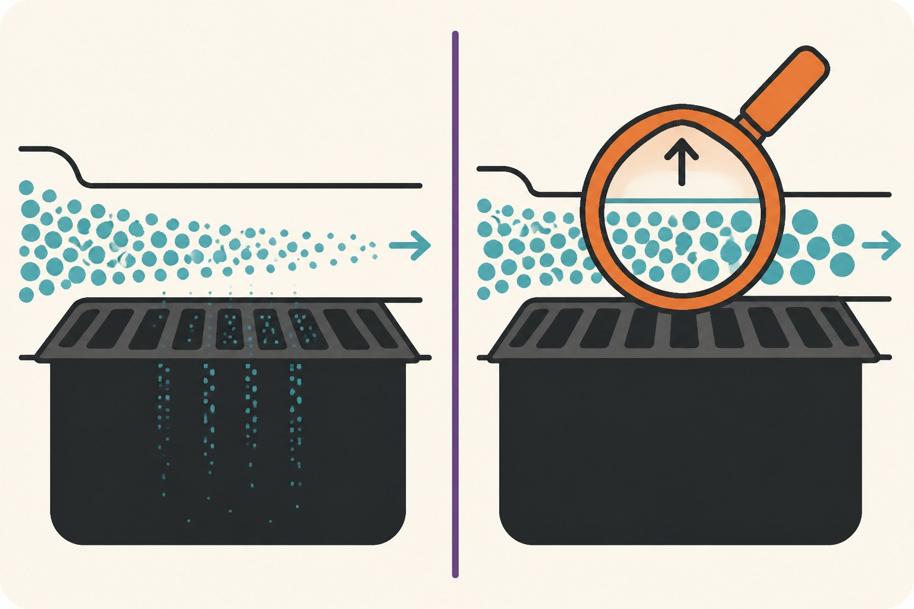

[Last week I timed the two "free speedup" flags](/posts/tf32-cudnn-benchmark-measured) and ended with a ResNet18 training step at 17.6 ms — TF32 convolutions, tuned cuDNN algorithms, everything the checklists promise. But TF32 is really half-precision-lite: same float32 tensors in memory, just multiplied through tensor cores with a shorter mantissa. The full version of the idea is `torch.autocast`, which actually *stores* activations in 16 bits and rewires which ops run in which precision. That's the next rung down the ladder, so this week I climbed down it, on the same GPU, with the same stopwatch discipline.

Setup as before: PyTorch 2.6.0, RTX 4080 Super, ResNet18 training step (forward, backward, optimizer step) at 224×224, median of 50 iterations after warmup, peak memory from `torch.cuda.max_memory_allocated()`. The baseline already includes last week's flags, so every gain below stacks *on top of* TF32, not instead of it.

## The headline table

| batch | fp32 (TF32 on) | bf16 autocast | fp16 autocast |
|---|---|---|---|
| 32 | 17.4 ms / 776 MB | 11.6 ms / 485 MB | 10.8 ms / 485 MB |
| 128 | 75.8 ms / 2831 MB | 47.5 ms / 1638 MB | 43.8 ms / 1640 MB |

Two clean findings. Speed: **1.5–1.7x on top of the TF32 baseline**, growing slightly with batch size, with fp16 consistently a few percent ahead of bf16. Chained with last week's numbers, the distance from "no flags at all" to "fp16 autocast" on this workload is almost exactly 2x — and unlike last week's 3% celebrity flag, this one actually moves the needle.

Memory is arguably the bigger story: **38–42% less peak memory**, because activations — which dominate training memory at these batch sizes — are now half the bytes. In practice that's not just a smaller number on a dashboard; it's the difference between batch 128 fitting comfortably and batch 256 being possible at all. Several times I've wanted mixed precision less for the milliseconds than for the headroom.

## The part everyone copies without knowing why

Every AMP example carries the same three extra lines, and I typed them for years on faith:

```python
scaler = torch.amp.GradScaler("cuda")

with torch.autocast("cuda", dtype=torch.float16):
    loss = F.cross_entropy(model(x), y)
scaler.scale(loss).backward()
scaler.step(opt)
scaler.update()
```

The stated reason: small gradients underflow to zero in fp16, so the loss gets multiplied by a large factor before backward (pushing gradients up into representable range) and unscaled before the optimizer step. Reasonable story. But how many gradients actually underflow, on a real model rather than in a textbook diagram? I had never seen that number, so I produced it.

I took the FashionMNIST CNN [I trained for the quantization post](/posts/quantizing-onnx-models-in-practice), ran a training batch through it, and examined all 267,787 nonzero gradient values against fp16's smallest representable magnitude (about 6e-8). The median gradient was 8.3e-4 — comfortably safe. But the distribution has a long quiet tail: **0.35% of the gradients were below the fp16 floor and would have silently become zero.** One value in every ~300, on a healthy, converged, unremarkable model. With the scaler's default loss scale of 65536 applied, that fraction dropped to 0.0004% — one in 250,000.

Whether 0.35% silent gradient loss actually hurts convergence depends on the model and where those tiny gradients live — early layers of deep networks are the classic casualty, and the failure mode is gradual degradation, not a crash. That's precisely what makes it nasty: [I've written about noisy, hard-to-attribute accuracy differences before](/posts/batch-level-gpu-augmentation-accuracy), and an unscaled fp16 run losing half a point would look exactly like bad luck. The three boilerplate lines are cheap insurance against a bug you would never trace.



## bf16: the same speedup without the insurance policy

bfloat16 spends its 16 bits differently — it keeps float32's full exponent range and sacrifices mantissa instead. The consequence for the underflow story is blunt: bf16 can represent magnitudes down to ~1e-38 (and subnormals far below), so gradient underflow is effectively impossible and **the scaler becomes unnecessary**. The autocast line changes to `dtype=torch.bfloat16` and the other three lines simply disappear.

What you pay: 8 bits of mantissa versus fp16's 11, i.e. coarser precision per value — and in my timings, about 7–8% less speed than fp16 on this GPU. What you get: a training loop with no scaler state, no skipped steps when the scaler backs off, one less moving part when something diverges and you're bisecting causes.

My own default after this exercise: **bf16 for training on hardware that supports it well (Ampere and later), fp16 + scaler when I need the last few percent** or when a target platform prefers fp16. If you inherit code with fp16 and no scaler, now you know exactly what's quietly leaking: about one gradient in three hundred.

## One small toll on the way out

The `GradScaler` line in my first draft of the benchmark used the spelling every old tutorial uses — `torch.cuda.amp.GradScaler()` — and PyTorch 2.6 answered with a deprecation warning pointing to `torch.amp.GradScaler("cuda")`. Trivial to fix, but a fitting footnote: even the boilerplate you copy correctly has a shelf life. The measured claims in this post will age the same way. The GPU after this one, or the PyTorch after this one, will shift these ratios — which is why the script that produced them is thirty lines and takes two minutes, and the table above is dated the day it was true.
