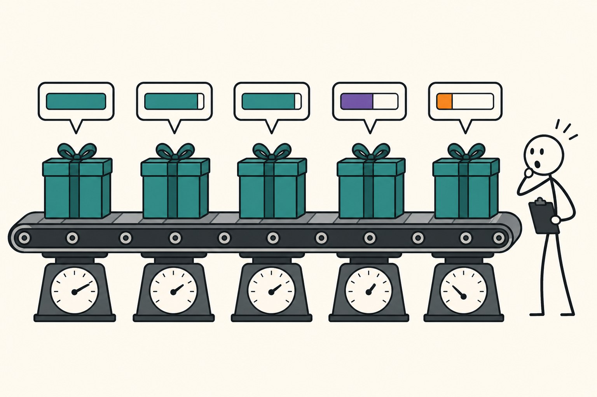

In [my post on preparing IMU data for deep learning](/posts/preparing-imu-sensor-data-for-deep-learning) I stated, with the confidence of someone repeating hard-won lab wisdom, that you must split train and test by *subject* — by person — because random window splits leak information and inflate your accuracy. I believe that advice. I have also never publicly attached a number to it, which by this blog's standards makes it folklore. So I ran the experiment, and as has become a pattern, the number I went looking for turned out to be the less interesting one.

The data is UCI HAR, the closest thing human activity recognition has to MNIST: 30 subjects, smartphone accelerometer and gyroscope at 50 Hz, six activities (walking, stairs up/down, sitting, standing, lying), already windowed into 10,299 windows of 128 samples × 9 raw channels. The model is a small three-layer 1D CNN — nothing exotic, a few seconds to train. Both protocols hold out ~30% of windows for testing; the only difference is *how* the holdout is chosen. Random: shuffle all windows, cut. Subject: pick 9 of the 30 people and hold out every window they produced, so the test set is entirely people the model has never seen — which is, of course, the actual deployment condition for any activity tracker. Five seeds each, per-channel normalization computed on train data only (the prep post explains why), fresh subject draw per seed.

## The number I went looking for

| protocol | test accuracy (5 seeds) |
|---|---|
| random window split | 96.29% ± 0.24 |
| subject split | 94.46% ± 1.41 |

The leakage is real and points the direction folklore says: random splitting inflates accuracy — by **1.8 points** here. The mechanism is concrete on this dataset: UCI HAR's windows overlap by 50%, so a random split routinely puts a window in train whose immediate 64-sample-sharing neighbor sits in test. The model gets partial credit for memorization and the evaluation can't tell.

But I'd be writing a dishonest post if I pretended 1.8 points was the catastrophe my earlier warning implied. It isn't ten points; a leaderboard built on the wrong split would rank models mostly the same way. If the story ended there, the verdict would be "correct advice, overstated stakes." It doesn't end there, because the two columns differ in a second way: look at the standard deviations. The random split is stable across seeds (±0.24); the subject split swings six times harder (±1.41). That spread is not training noise — it's the test-subject lottery. And pulling on that thread led to the actual finding.

## The number that was hiding under it

For every subject-split run I also recorded accuracy *per held-out person*. Across the 45 subject evaluations, the spread looks like this: several subjects score a clean 100%. Subject 14 gets 81%. Subject 16 gets 77%. Subject 10 — a person indistinguishable in the aggregate table — gets **73.5%**.

So the model that reports "94.46% accurate" is a 100% model for some people and a 74% model for others, and the aggregate number is just where the lottery averaged out. One person in your test draw moves the headline by a full point; deploy to a population and a meaningful fraction of users get an experience twenty points worse than your benchmark claimed. People wear sensors differently, move differently, climb stairs at different cadences — none of which a model trained on 21 other people is guaranteed to cover. This is presumably obvious to anyone who has shipped a wearable product. It was theoretical to me until Friday.

Here's the part that closes the loop on the split question: **the random split cannot see any of this.** Shuffle everyone's windows together and every test window comes from a person the model already studied — per-user accuracy collapses into one comfortable average and the existence of subject 10 disappears from your metrics entirely. The deepest cost of the wrong split isn't the 1.8 points of inflation; it's that the evaluation stops being able to ask "who does this fail for?" — which, on sensor data attached to human bodies, is usually the question that decides whether the thing ships. I made a similar argument about [aggregate metrics hiding failure modes for LLMs](/posts/why-perplexity-is-a-vanity-metric-for-llm-evaluation); apparently I needed to rediscover it in my home domain with a stopwatch and five seeds.

## What changes in my own evaluations

Three concrete adjustments, in order of cost. First — unchanged — split by subject, but now with an honest justification: not primarily for the 1.8 points, but because it's the only protocol that measures the deployment question. Second, report the per-subject *distribution*, or at least worst-subject accuracy, alongside the mean; it costs one groupby and it's where the product risk lives. Third, treat single-draw benchmarks with 9 test subjects as ±1.4-point measurements — two papers claiming 95.1% and 96.3% on the same dataset with different subject draws may be reporting the same model. Full leave-one-subject-out (30 runs here, under two minutes at a few seconds per model) is the proper instrument when a comparison actually matters.

The prep post's advice survives, then, but the reasoning under it got replaced: I warned you about leakage and should have warned you about people. On this dataset the leakage was worth 1.8 points; the difference between the luckiest and unluckiest human was worth 26. Measure whichever one you've been ignoring.
