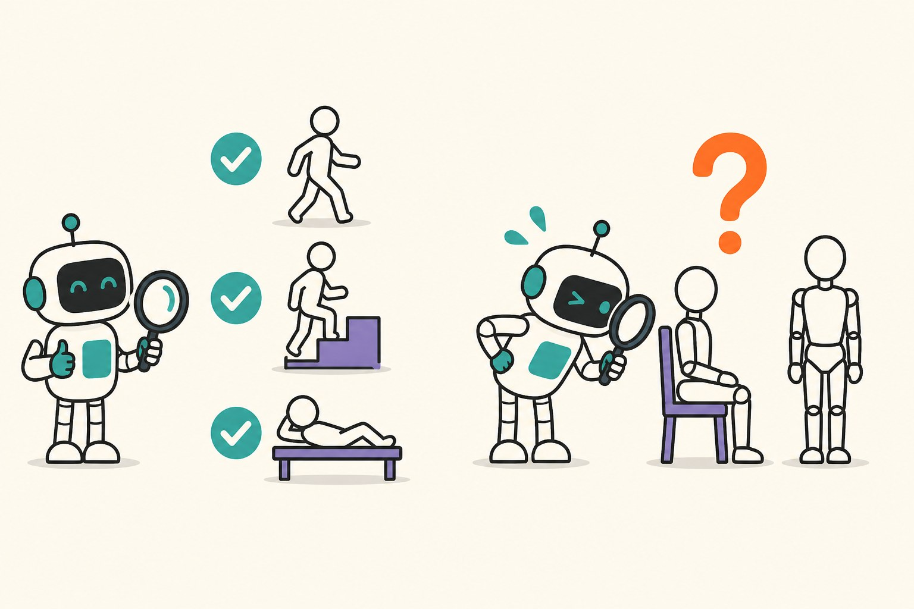

[Yesterday's post](/posts/imu-har-subject-vs-random-split) ended with a promise I half-expected to regret: that full leave-one-subject-out — train 30 models, each tested on one person the model has never seen — is the proper instrument, and cheap enough to actually run. It was cheap: a few minutes of GPU time for the full sweep on the small 1D CNN. This post is what the instrument showed, because the aggregate numbers from yesterday turned out to be hiding something with a very specific shape.

Setup, briefly: UCI HAR again, 30 subjects, six activities from waist-worn smartphone accelerometer and gyroscope, the same three-layer 1D CNN. For each subject, train on the other 29, test on them alone. Normalization uses training-set statistics only, as always.

## The distribution, now with all thirty people

Mean LOSO accuracy: **94.31%, standard deviation 6.66 across subjects**. Eight of the thirty people score a perfect 100%. The bottom of the distribution: subject 16 at 77.0%, subject 14 at 77.7%, subject 10 at 81.3%. Yesterday's headline — the aggregate hides a 26-point spread between humans — survives the full sweep intact. But with every subject evaluated, a new question becomes answerable: *what do those bottom-tail errors actually consist of?* And that's where the story stops being about statistics.

## 86% of all errors are one pair of activities

Pooling the confusion matrix across all 30 held-out subjects, out of 567 total misclassifications, **485 — 86% — are sitting confused with standing**, in one direction or the other. Everything else barely registers: lying down is recognized perfectly, all 1,944 windows, every subject. Stairs up and stairs down each clear 99.7%. The only other visible seam is walking occasionally read as stairs-up — 58 windows, about 10% of the error budget — which drags walking recall to 96.6% and exhausts essentially everything the sit/stand pair didn't claim.

So "the model is 94% accurate" was never the right sentence. The truthful sentence is: **the model is nearly flawless at everything except telling sitting from standing, and for certain bodies it can barely tell them apart at all.** The worst subjects aren't people the model generally misreads — they're people whose sitting posture, as seen by a waist-mounted IMU, looks like other people's standing.

The mechanism is almost embarrassingly physical. Sitting and standing are both static postures; the accelerometer signal is essentially the gravity vector filtered through wherever the device rests on your body. Distinguishing them means distinguishing hip/torso angle — which varies with how you sit, your build, and how the phone was mounted. There's no motion signature to save you, the way there is for walking or stairs. The IMU preprocessing post [talked about gravity as a design decision](/posts/preparing-imu-sensor-data-for-deep-learning); here it is deciding 86% of the error budget of a whole benchmark.

## The calibration experiment

That mechanism suggests its own countermeasure. If the failure is "this person's static posture geometry doesn't match the training population," then normalizing each subject's signals *by their own statistics* — rather than by the global training statistics — should pull everyone's data into a shared frame. Deployment-wise this is realistic: it's per-device calibration, computable on-device from a short stretch of the user's own data, no labels needed.

Rerunning the entire LOSO sweep with per-subject normalization — another 30 models, so the day's total is 60:

| | global norm | per-subject norm |
|---|---|---|
| mean LOSO accuracy | 94.31% | 95.75% |
| std across subjects | 6.66 | 5.19 |
| worst subject | 77.0% | 82.7% |
| subjects at 100% | 9 | 12 |

The mean moves +1.4 points, which is nice but not the point. The point is the tail: subject 16 goes from 77.0% to 84.7%, subject 14 from 77.7% to 88.5% — the two worst users recover **roughly half of their gap to the mean**, and the sit/stand confusions drop from 485 to 368. Exactly where the mechanism predicted the fix would land, it landed.

And, in keeping with this blog's apparently unbreakable law that no intervention is free: two subjects got *worse*. Subject 9 dropped from 86.8% to 83.7%, and one of the previously perfect subjects slipped to 96%. Per-subject statistics computed over someone's full recording fold that person's activity mix into the normalization, and for a few people that shifts the frame the wrong way. On net the trade is clearly positive — higher mean, tighter spread, better floor — but it reshuffles individuals, and if I shipped this I'd want the calibration computed from a controlled still-posture snippet rather than from whatever the user happened to be doing.

## What the 60 models actually taught me

The efficient path I'd recommend to anyone doing HAR-like work, in the order I now wish I'd done it: run the per-class confusion *before* anything else, because "94% accurate" turned out to mean "one binary distinction is broken for a minority of bodies" and no amount of aggregate-level tuning would have found that. Then let the failure's physics propose the fix — the calibration idea wasn't clever, it fell straight out of the gravity mechanism, and it recovered more accuracy for the users who needed it than any architecture change I might have reached for first. And keep reporting the distribution: the mean moved 1.4 points under an intervention whose real effect was +7.7 for one human and −3.1 for another.

Sixty models, three minutes of GPU each way, and the benchmark's single number turned into a mechanism, a fix, and a known cost. That's a good exchange rate — the kind you only get access to after you split by subject, which is where this two-post detour started.
