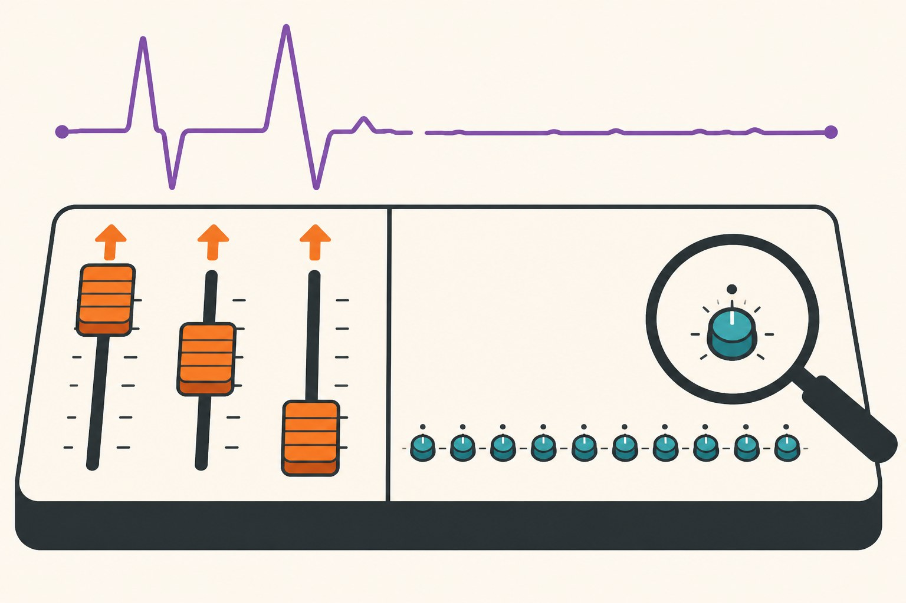

[Yesterday's post](/posts/seed-noise-vs-real-improvements) ended in an uncomfortable place: my pipeline's seed-to-seed noise is 1.17 percentage points of test accuracy, label smoothing's real +0.35%p improvement drowns in it, and effects that small need triple-digit seed counts to confirm. The natural follow-up question is the practical one: **which knobs are big enough to rise above that noise?** If the trick tier is undetectable, what's in the detectable tier?

So I measured it. Same setup as yesterday — ResNet18 on CIFAR-10, 10 epochs, so the 15-seed baseline distribution (87.86% ± 1.17) carries over for free — and six deliberately common perturbations, three seeds each. Every effect is reported two ways: percentage points, and multiples of the seed-noise sigma, which after yesterday feels like the only honest unit.

## The ranking

Sorted by how hard each change hits, against baseline lr=0.1, weight decay 5e-4, standard crop+flip augmentation, batch 128:

| change | accuracy (3 seeds) | vs. baseline | in seed-noise units |
|---|---|---|---|
| batch 512, lr untouched | 83.32% | **−4.54%p** | **−3.9σ** |
| weight decay → 0 | 85.03% | −2.83%p | −2.4σ |
| augmentation off | 85.31% | −2.55%p | −2.2σ |
| lr 0.1 → 0.2 | 86.09% | −1.77%p | −1.5σ |
| **lr 0.1 → 0.05** | **88.90%** | **+1.04%p** | **+0.9σ** |
| lr 0.1 → 0.02 | 87.53% | −0.33%p | −0.3σ |
| *(label smoothing, yesterday)* | *88.21%* | *+0.35%p* | *+0.3σ*|

Two tiers are immediately visible, with a gap between them. The fundamentals — regularization, augmentation, the batch-size/learning-rate coupling — move accuracy by 1.5 to 4 sigma. Applying yesterday's rule (a gap must beat twice its standard error), every one of those clears the bar comfortably *with only three seeds*: weight decay's absence, for instance, sits five and a half standard errors from baseline. These are the effects you can detect on a Tuesday afternoon without a seed farm. Then there's the trick tier — label smoothing at +0.3σ, lr 0.02 at −0.3σ — which three seeds cannot distinguish from nothing, exactly as yesterday's arithmetic predicted.

## The row that embarrassed me

Halving the learning rate to 0.05 gained **+1.04%p** — three times the effect of label smoothing, and it passes the significance test that label smoothing failed (2.6 standard errors above the 15-seed baseline). Which means yesterday I burned fifty minutes of GPU on thirty models to chase a +0.35 trick *while my baseline learning rate was leaving a full point on the table*. I had mentally filed lr=0.1 under "settled, standard for ResNet-on-CIFAR" — but that convention comes from 200-epoch schedules, and at 10 epochs the cosine decay spends much less time at low learning rates, so a gentler peak wins. The most valuable knob in this entire experiment was one I had stopped thinking of as a knob.

The other end of the table teaches the same lesson more violently. Quadrupling the batch to 512 without touching the learning rate didn't just lose 4.5 points — it got *unstable*: seeds landed at 84.48, 84.43, and 81.06, a spread three times the baseline's seed noise. Effectively I'd cut the number of gradient updates per epoch to a quarter without compensating the learning rate for it — the linear scaling rule says lr should have gone to 0.4 — and the result is the worst of both worlds: worse on average, wilder run to run. Anyone who's "just bumped the batch size to use the new GPU" and shrugged at the accuracy dip has met this row of the table.

## Order of operations

What this table amounts to is a debugging priority list. The knobs worth checking first are the ones whose effects are multiple sigma — augmentation present, weight decay nonzero, learning rate sane for *your* schedule length and coupled to *your* batch size. Any of those being wrong costs more than every trick in the trick tier combined can repay. Only once the multi-sigma knobs are pinned does it make sense to descend into the sub-sigma tier, and yesterday's post says what descending costs: seeds, in bulk.

Scope, honestly: 10-epoch schedule, one model, one dataset. At full convergence the rankings shift — weight decay tends to matter even more, batch 512 becomes fixable with properly scaled LR and warmup, and lr=0.05's advantage over 0.1 may invert. This table isn't a lookup of universal constants; it's a demonstration that effect sizes are measurable, cheap to measure (eighteen runs, half an hour, thanks to [this week's 98-second training loop](/posts/dataloader-num-workers-windows)), and wildly unequal. The expensive mistake isn't picking the wrong trick. It's tuning tricks at all while a two-sigma fundamental sits wrong underneath them.
