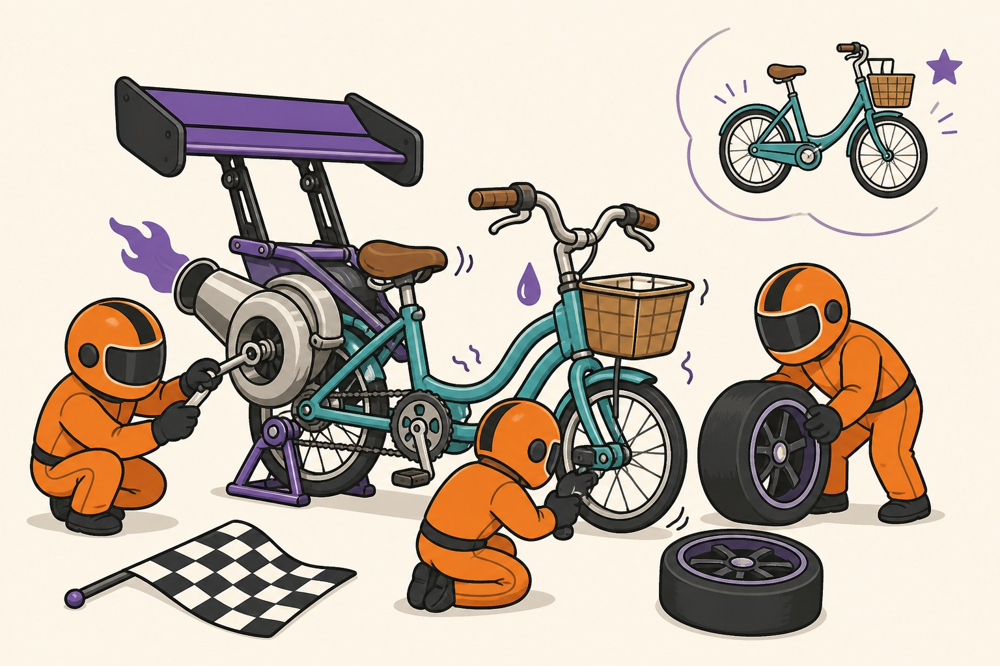

[Friday's knob-ranking post](/posts/training-knob-effect-sizes) had a throwaway line in its scope section: batch 512's disastrous −4.5%p "becomes fixable with properly scaled LR and warmup." I wrote that from memory of the literature, not from measurement, and it nagged at me all weekend — this blog exists because untested claims are how I got into trouble in the first place. So today: the textbook fixes, applied to Friday's worst-performing configuration, three seeds each. Every single one made it worse. This post is the autopsy, and the fine print I should have read before citing the rule.

## The fixes, applied

The reference points, from earlier posts: batch 128 with lr 0.1 scores 87.86% (±1.17 over 15 seeds); naively switching to batch 512 with lr untouched drops to 83.32. The textbook — specifically the linear scaling rule from Goyal et al.'s ImageNet-in-an-hour paper — says: multiply LR by the batch-size ratio (4x → lr 0.4) and add warmup to survive the early instability. Some practitioners prefer square-root scaling (2x → lr 0.2). Here's what those prescriptions measured, batch 512, 10 epochs, three seeds each:

| configuration | accuracy | vs. batch-128 baseline |
|---|---|---|
| lr 0.1, untouched (Friday) | 83.32 (±1.96) | −4.5%p |
| lr 0.4, linear scaling | 59.95 (±4.07) | **−27.9%p** |
| lr 0.4, linear scaling + warmup | 56.96 (±2.44) | −30.9%p |
| lr 0.2, sqrt scaling + warmup | 67.20 (±3.28) | −20.7%p |
| lr 0.1 + warmup only | 76.70 (±1.36) | −11.2%p |
| **lr 0.05, no warmup** | **85.12 (±0.14)** | **−2.7%p** |

The prescribed fix — linear scaling with warmup — landed at 56.96%, thirty points below baseline and twenty-six below the "disaster" it was supposed to repair. The gentler sqrt rule lost twenty. And the row that made me double-check my scheduler: adding warmup to the *unchanged* learning rate cost 6.6 points on its own. I printed the LR trajectory step by step looking for a bug (warmup epoch at 0.01, jump to 0.1, clean cosine decay — the schedule was exactly right), then re-ran Friday's configuration from scratch to make sure the harness still reproduced it. It did, to within 0.05%p. The results are real.

## Why the textbook backfired

The linear scaling rule wasn't derived for my situation, and the paper says so — Goyal et al. worked with 90-epoch ImageNet schedules, and even there they note the rule breaks down early in training, which is exactly why their warmup exists. My schedule is 10 epochs. That changes the arithmetic in two compounding ways.

First, warmup's cost scales with schedule length. A one-epoch warmup on a 90-epoch schedule spends ~1% of the budget at reduced learning rate; the same warmup at 10 epochs spends 10%, and squeezes the cosine decay into the remaining nine. At batch 512 there are only 97 optimizer steps per epoch — 970 total — and giving away 97 of them buys stability that this workload apparently didn't need and pays points it couldn't spare. Advice that is nearly free in its native regime becomes a 6.6-point tax in mine.

Second, the scaling rule assumes you're compensating for *fewer steps* by taking *bigger* ones, which works when training runs long enough to absorb the turbulence bigger steps cause. In 970 steps there is no absorbing anything: lr 0.4 damaged the model early and the schedule ended before recovery. The tell is in Friday's data, inverted: at batch 128, doubling lr to 0.2 cost only 1.8 points — at batch 512, running lr 0.2 cost twenty. Large batches at short schedules are *more* fragile to high LR, not more tolerant, which is the exact opposite of what the rule prescribes.

## What actually worked

The best batch-512 configuration I found came from ignoring batch size entirely and reusing Friday's other discovery: this 10-epoch schedule likes lr 0.05 regardless. At batch 512 it scored **85.12%** — and with a seed spread of ±0.14, versus ±1.96 at lr 0.1. The lower learning rate didn't just recover 1.8 points; it eliminated the run-to-run instability that made Friday's batch-512 row so ugly. (Also tested: lr 0.025 overshoots into under-training, 82.11. The optimum really is around 0.05 — for both batch sizes.)

But the honest conclusion isn't "use lr 0.05." It's that at this training budget, **batch 512 has no upside at all**. Its best configuration still sits 2.7 points below the batch-128 baseline and 3.8 below batch-128's own best. It isn't even faster: 8.2 seconds per epoch versus 7.4 — this small model saturates my GPU well before batch 128, so quadrupling the batch just quadruples how much accuracy each optimizer step has to carry, for nothing in return.

Scope: everything here is 10-epoch, one model, one dataset — at 90-plus epochs with gradual multi-epoch warmup, the regime the rule was written for, I'd expect the textbook to perform much better. That's the actual lesson, sharper than Friday's version: hyperparameter advice ships with an invisible *schedule* attached, not just an invisible OS ([as the DataLoader saga taught me](/posts/dataloader-num-workers-windows)). And claims you publish without measuring have a way of costing you a Monday — this one cost twelve training runs to retract, which is cheap as these things go.
