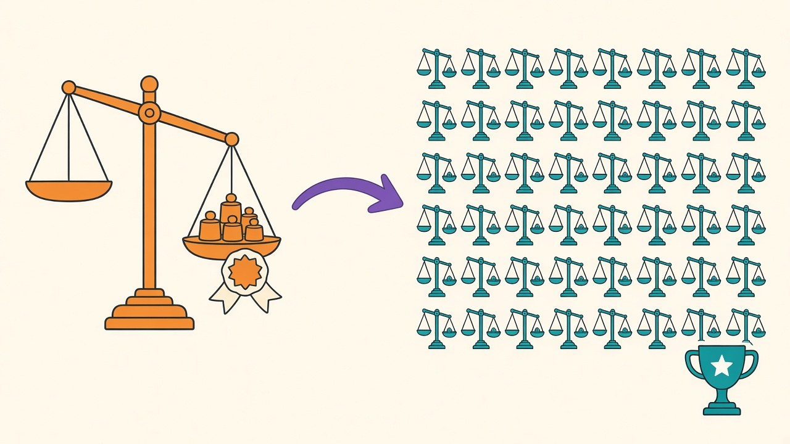

[Last week's augmentation post](/posts/imu-augmentation-measured) ended with a hedge I wrote deliberately: scaling augmentation seemed to lift the worst held-out subject by two points, but the gain leaned on one lucky split, so I filed it as "a hypothesis worth fifty splits, not a result." This blog has a rule about sentences like that now — [unverified claims get measured](/posts/batch-512-textbook-fixes-measured), especially my own. HAR training runs take three seconds. Fifty random subject splits, four configurations, 200 training runs, eight minutes of GPU. There was never going to be an excuse.

## The fifty-split verdict

Same protocol as before — nine held-out subjects per split, paired comparisons against baseline within each split — but now with enough statistical muscle to resolve half-point effects. Paired deltas versus baseline, fifty splits:

| augmentation | overall accuracy | worst subject | wins (of 50) |
|---|---|---|---|
| jitter 0.1σ | **−0.38** (t = −4.9) | −0.49 (t = −2.1) | 11 |
| scaling ±10% | +0.15 (t = +2.8) | +1.00 (t = +3.2) | 33 |
| rotation ±15° | **+0.35** (t = +3.4) | **+1.55** (t = +4.6) | 34 |

Three verdicts, in ascending order of how much they surprised me.

Jitter's conviction stands. Eleven wins out of fifty, t below −4.8 — the recommendation that leads every sensor-augmentation tutorial reliably subtracts a third of a point from this task, for the reason the last post argued: static postures live in small steady gravity offsets, and Gaussian noise is a machine for erasing exactly those.

The scaling hypothesis — the reason this experiment exists — is confirmed, at half strength. The worst-subject gain is real (+1.00, t = 3.2) but half the two-point hint; the lucky split that drove last week's number was, as suspected, flattering it. This is the boring, healthy outcome: the small sample saw a real effect and exaggerated it.

And then the surprise. **Rotation, which five splits filed under "null," is the best augmentation on every metric.** Plus 0.35 overall — more than double scaling's gain — and +1.55 on the worst subject, t = 4.6, the strongest effect in the table. It also *narrows* the spread: worst-subject standard deviation drops from 8.6 to 7.9, overall from 2.75 to 2.42. Rotation doesn't just raise the average; it specifically rescues the people the model serves worst, which for a wearable product is the metric that decides returns and refunds.

## Small samples don't just miss effects — they misrank them

The uncomfortable takeaway isn't that five splits lacked power; I knew that and said so. It's that the five-split experiment produced a *plausible wrong answer*: it pointed at scaling as the promising augmentation and rotation as noise, when the truth is the reverse. If I'd had slightly less caution — or slightly more deadline — the production recipe would have shipped with the second-best augmentation and without the best one. Underpowered experiments don't return "insufficient data"; they return confident-looking rankings drawn from a lottery. That's a sharper version of what [the seed-noise post](/posts/seed-noise-vs-real-improvements) measured for single comparisons.

One more small embarrassment worth recording: the five-split baseline read 94.45%; the fifty-split baseline is 92.67%. The first five seeds happened to draw easy test subjects. Even the *headline number* of last week's post was nearly two points of luck.

## The recipe, and the eight-minute excuse

So the measured IMU augmentation policy, final form: **rotation ±15° on, scaling optional, jitter off.** The physical story is satisfying — rotation simulates exactly the variation that subject splits expose, differences in device mounting and body geometry, so it patches the model's weakness where it's weakest — but the story only earned belief after the statistics did.

The meta-lesson is the one this blog keeps circling: at three seconds per training run, the fifty-split experiment costs less than a coffee break, and it *reversed* the practical conclusion of its five-split predecessor. For small models — and sensor models are almost all small models — the barrier to real statistics isn't compute anymore. It's remembering that the cheap version of the experiment isn't just imprecise; it can be precisely wrong.
