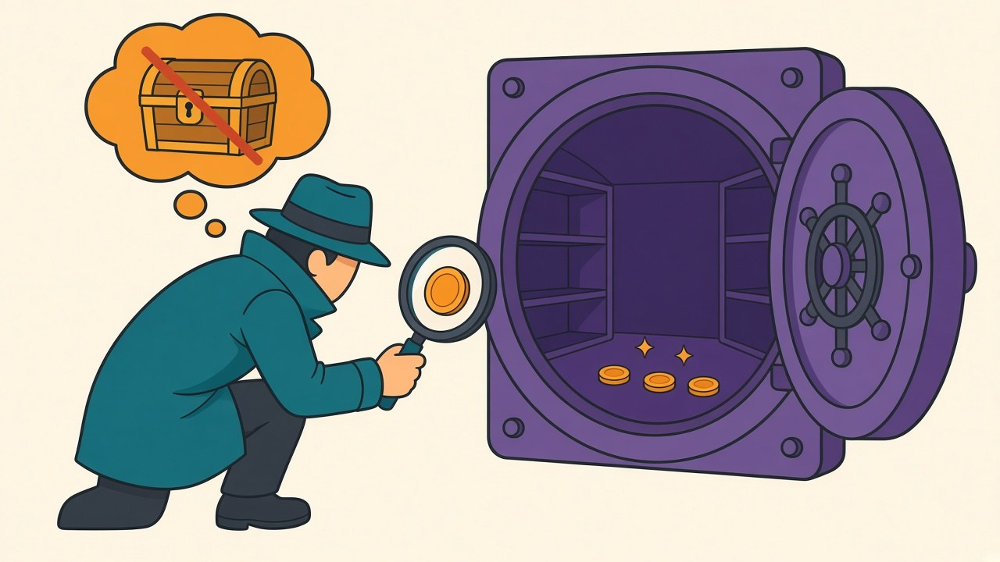

There's a piece of PyTorch advice I've repeated without measuring, which [recent history suggests](/posts/batch-512-textbook-fixes-measured) is exactly the kind I should test: *don't call `loss.item()` every step — it forces a GPU synchronization and kills your pipeline.* It appears in performance guides, code reviews, and at least one of my own old commit messages. The claim has a solid mechanistic core: PyTorch queues GPU work asynchronously, `.item()` makes the CPU stop and wait for the queue to drain, and stalling the dispatcher every step *sounds* expensive. Today I tried to measure how expensive — and mostly failed to find the crime scene.

## Five attempts to make the tax appear

All runs on GPU-resident synthetic data, so [the DataLoader can't hide anything](/posts/dataloader-num-workers-windows); 300+ steps per config, best of repeated passes. First, eager mode, small and large models:

| logging style | SmallResNet (5.5 ms steps) | ResNet50 (121 ms steps) |
|---|---|---|
| nothing (sync once at end) | baseline | baseline |
| `loss.item()` every step | +1.4% | 0% (noise) |
| `.item()` every 10 steps | +0.7% | 0% |
| GPU-side accumulation, one `.item()`/epoch | +0.1% | 0% |
| bare tqdm bar | +0.2% | 0% |
| tqdm + `set_postfix(loss=...)` | **+5.2%** | 0% |

For the big model the tax is unmeasurable — every variant lands within run-to-run noise. For the small model, the famous sync costs about one percent, and the only line that clears 5% is `set_postfix`, whose cost is mostly *doing string formatting 180 times a second*, not synchronizing.

So I escalated. Sub-millisecond steps, where a fixed sync cost should hurt proportionally most — a tiny four-layer MLP at 0.71 ms/step, the reinforcement-learning regime: `.item()` every step costs **+3.8%**. Then `torch.compile`, including `reduce-overhead` mode with CUDA graphs, where a mid-loop sync should be maximally rude: **+5.0%** (and +7.4% with the default backend, the worst number I managed to produce all afternoon). That's the entire haul. The advice implies double-digit destruction; five regimes of trying produced a worst case of seven percent and a typical case near two.

## Why the horror story doesn't reproduce

The mechanism turns out to be self-limiting, from both directions. When steps are *tiny*, the loop is CPU-dispatch-bound — the GPU finishes each kernel before the CPU can queue the next, so the queue is always nearly empty and draining it costs almost nothing. When steps are *big*, the queue is deep, but `.item()` merely waits for work that had to run anyway; the true waste is only the bubble while the CPU re-fills the pipeline afterward, a few tens of microseconds against a 121 ms step. The tax would need a middle regime — deep queues *and* fast steps *and* a slow dispatcher — to bite the way the folklore describes. On a modern desktop CPU feeding a modern GPU, that regime is thin.

Where did the folklore come from, then? Partly from real but different sins that ride along with logging: printing to an actual console every step (catastrophically slow on some terminals), flushing TensorBoard writers per iteration, computing extra metrics on the GPU and `.item()`-ing each one separately. Partly from environments where the claim is genuinely true at scale — XLA/TPU, where a host roundtrip can trigger recompilation, and distributed training, where one rank's stall becomes everyone's stall (untested here, and I'd expect the tax to multiply). And partly, I suspect, from the era of slower CPUs, when the dispatch bubble was fatter relative to everything else. The advice, as usual, [shipped without its context attached](/posts/training-knob-effect-sizes).

## What I'll actually do differently

Almost nothing — which is the finding. `loss.item()` per step stays in my loops; the readable version of the code costs one to four percent on small models and nothing on large ones, and readability wins at that price. The two changes worth making: `set_postfix` on every iteration of a fast loop gets replaced with a postfix update every 50 steps (its 5% was the biggest legitimate line item on the board), and for the rare loop where every percent matters, the GPU-accumulation pattern — `loss_sum += loss.detach()`, one `.item()` per epoch — measured genuinely free.

Scope: one machine, one very fast CPU, no distributed, no TPU; if your trainer runs on eight ranks or XLA, the folklore may still be law there. But for the single-GPU case where this advice gets dispensed most freely — code reviews of student projects and desktop experiments — the famous tax is pocket change, and the real money [was in the input pipeline all along](/posts/dataloader-num-workers-windows). It took an afternoon and five regimes to fail to confirm a claim I've repeated for years. That ratio — years of repetition, one afternoon to check — is the recurring arithmetic of this blog.
