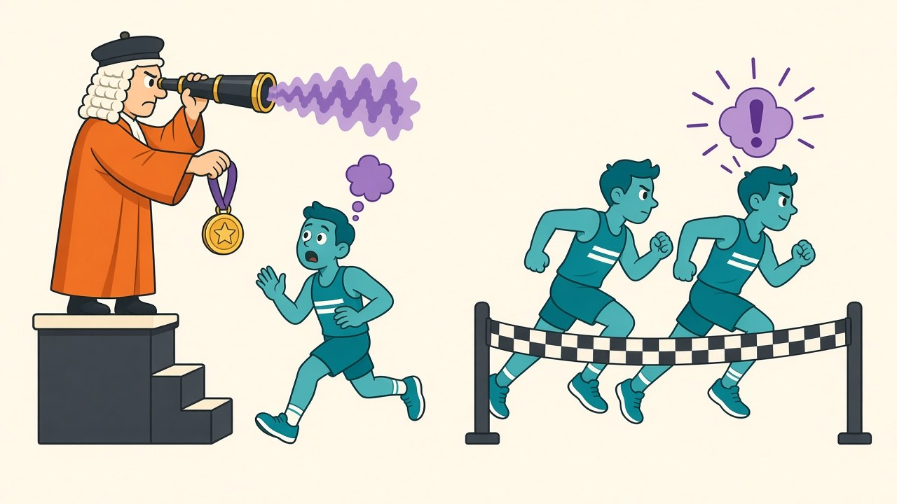

Hold out a validation set, checkpoint every epoch, keep the checkpoint with the best validation accuracy — this is such settled procedure that it's built into every training framework and I have typed it for years without asking what it buys. This week's realization that [my noise floor responds to tuning](/posts/ema-weights-measured) made the question measurable: with seed noise at ±0.2, even small costs of standard practice become visible. So, fifteen seeds of the usual 10-epoch cosine CIFAR ResNet18, this time with 5,000 images held out for validation and both validation *and* test accuracy recorded every epoch — which means for every run I can compare three checkpoints exactly: the last epoch, the one validation would pick, and the oracle (the true best test epoch, knowable only in hindsight).

## The selection never had a chance to win

The oracle result first, because it decides everything: **in 15 runs out of 15, the true best test epoch was the last epoch.** A cosine schedule annealing to zero produces monotone-enough improvement that "when should I stop?" has a degenerate answer — at the end. Under these conditions checkpoint selection has *zero upside by construction*: the best it can do is agree with "take the last epoch," and every disagreement is a loss.

Which is exactly how it played out:

| checkpoint strategy | test accuracy (15 seeds) | paired delta vs last epoch |
|---|---|---|
| last epoch | 88.00 ±0.22 | — |
| best-validation pick | 87.97 | −0.035 (t = −1.1) |
| oracle (best test epoch) | 88.00 | exactly 0.000 |

Thirteen times the validation set picked epoch 9 and matched the oracle. Twice it picked epoch 8 — and both times it was wrong, once costing 0.47 points. The reason is arithmetic, not judgment: a 5,000-sample validation set measures accuracy with a standard error around ±0.46 points, while the true test-accuracy difference between the last couple of cosine-annealed epochs is a few hundredths. The signal the selection needs to read is **ten times smaller than the noise of the instrument reading it**. Seed 11 is the cleanest specimen: validation scored epoch 8 above epoch 9 by 0.02 points — pure noise — and test disagreed by half a point in the other direction. At the tail of an annealed schedule, best-val selection is a random-number generator with a bias toward "slightly early."

## The part nobody bills: the validation set itself

The selection's −0.035 is a rounding error. The real invoice is one comparison away: these 45k-image runs average **88.00**, while [last week's identical recipe](/posts/ema-weights-measured) trained on all 50k images averaged **88.86**. The 5,000 images I set aside to enable checkpoint selection cost **0.86 points of test accuracy** — roughly 25 times the largest loss the selection ever prevented, spent up front, every run, as the entry fee for a procedure that then went 0-for-15 against doing nothing. On a 50k dataset, 10% of the data is not a free administrative reserve; it's the most expensive line item in this whole experiment.

## Where the standard practice still earns its keep

Scope, drawn honestly, because early stopping isn't folklore in general. It earns its keep when the test curve actually *turns* — long trainings that overfit, noisy labels, small datasets with big models, constant learning rates, fine-tuning runs that degrade after epoch two. It also has a second job this experiment didn't price: stopping *saves compute* when the curve plateaus early, which selection-at-the-end can't do. And at 10 epochs there was never much room to stop early in the first place — the regime where val-based stopping shines is exactly the regime my schedule avoids.

But that's the point worth writing on the config file: **the procedure and the schedule have to match.** A cosine schedule annealed to zero already encodes "train exactly this long, end at the bottom of the curve" — bolting best-val selection onto it buys nothing (the endpoint is the optimum), risks a noise-driven wrong pick (2 of my 15 runs), and if you fund the validation set out of training data, charges you close to a full point for the privilege. If the schedule already knows when to stop, the validator is a passenger with a ticket you paid for. I've retired the 45k/5k split for short annealed runs — the whole 50k trains, the last checkpoint ships, and the noise floor from the [EMA post](/posts/ema-weights-measured) says exactly what that decision is worth: +0.86, every time, for free.
