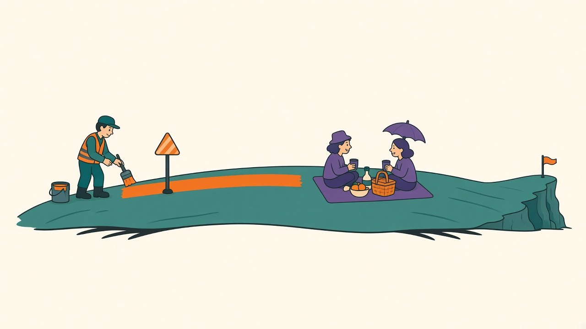

When [rotation won the augmentation tournament](/posts/har-augmentation-fifty-splits) last week, my implementation notes carried a warning delivered in the tone of physics: keep the angles small — ±15°, maybe less — because total acceleration contains gravity, and rotating too far tells the model that lying down looks like standing, "which isn't augmentation, it's sabotage." It's a satisfying argument. It has a mechanism, it sounds like domain expertise, and I never tested it, which after [the batch-512 episode](/posts/batch-512-textbook-fixes-measured) and [last week's small-sample reversal](/posts/har-augmentation-fifty-splits) should have set off alarms. Today: the dose-response curve. Six rotation ranges from 0° to ±90°, fifty paired subject splits each, 300 training runs, seventeen minutes.

## The curve

Paired deltas versus no augmentation, fifty splits per angle:

| rotation range | overall accuracy delta | worst-subject delta |
|---|---|---|
| ±5° | +0.09 (t = 2.2) | +0.33 (t = 1.4) |
| ±15° (last week's pick) | +0.36 (t = 3.4) | +1.53 (t = 4.5) |
| **±30°** | **+0.43 (t = 2.6)** | **+2.14 (t = 5.0)** |
| ±45° | +0.32 (t = 1.7) | +1.70 (t = 3.4) |
| ±90° | +0.18 (t = 0.8) | +2.09 (t = 3.5) |

Three things the table settles. First, ±5° is homeopathy — the invariance is too weak to matter. Second, the optimum isn't where I put the cap: **±30° beats ±15° on both metrics**, with the worst-subject gain climbing to +2.14, the largest augmentation effect this dataset has produced. Third, and most instructive: the sabotage I predicted **never materializes**. At ±90° — rotations violent enough to regularly swap "which way is down" — the overall gain fades toward statistical silence (+0.18, t = 0.8), but it never goes negative, and the worst-subject improvement *persists* at +2.09. The failure mode I warned about with a straight face does not exist at any angle I tested.

## Why the physical argument missed

The argument wasn't wrong about gravity; it was wrong about what the model depends on. Two things soften the blow of big angles. Uniformly sampled rotations up to ±90° still spend most of their probability mass at moderate angles, so the training distribution is diluted, not poisoned — which fits the shape of the curve, where ±90° behaves like a weaker dose of ±30° rather than a different drug. And the static-posture margin apparently leans on more cues than my mental model gave it credit for: relative channel patterns and short-scale dynamics survive rotation even when the absolute gravity direction is scrambled. Meanwhile the *hardest* held-out subjects — the ones who wear and move most unlike the training population — keep collecting the full benefit of aggressive invariance all the way out to 90°. The people the model serves worst are precisely the ones for whom "down" was least trustworthy to begin with.

The updated recipe, superseding last week's: **rotation ±30°** for this class of task, with ±15°–45° all defensible and nothing catastrophic anywhere. If your deployment has wildly variable mounting, the table says even extreme invariance costs little on average and keeps paying at the bottom of the per-subject distribution.

## The recurring disease

This is the third time this blog has caught the same pathogen in three different hosts: a rule with a *plausible mechanism* substituting for a measurement. The linear scaling rule had beautiful reasoning and lost 28 points; my seed-noise "law of nature" was [a configuration artifact](/posts/ema-weights-measured); and now my own gravity argument — written by me, about my own domain, in a post explicitly dedicated to measuring things — turned out to be a boundary I invented. Plausibility is how untested claims get past the reviewer, and the more domain expertise the author has, the more convincing the untested claim sounds. The sweep that corrected it cost seventeen minutes. Scope as always: one dataset, clean lab mounting, one model family — and the next time I write a confident physical argument in an implementation note, it comes with a t-statistic attached or it doesn't ship.
