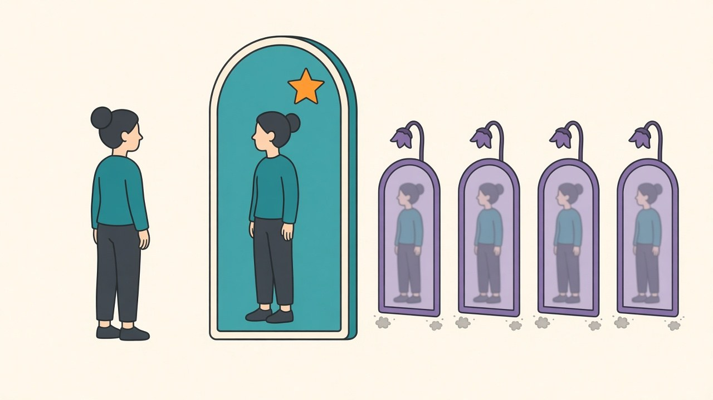

Test-time augmentation has a reputation problem: it's the trick Kaggle winners confess to in the last paragraph, the thing production engineers wave off as leaderboard cosmetics. The idea is almost embarrassingly simple — run inference on several transformed copies of the input, average the probabilities — and because it multiplies serving cost, most advice online rounds it down to "not worth it in the real world" without a number attached. After a month of measuring training tricks whose true effects turned out to be [+0.08](/posts/ema-weights-measured), [+0.14](/posts/seed-noise-vs-real-improvements), or [zero](/posts/har-augmentation-fifty-splits), I wanted TTA on the same scale. Ten seeds of the usual tuned CIFAR ResNet18 recipe, each model evaluated four ways — plain, mirror-flip averaging, five 2-pixel shifts, and shifts-plus-flips — with every comparison paired within run, plus clean warmed-up GPU timings for the actual price tag.

## The table that made me sit up

| view set | views | paired delta vs plain | wins | inference cost (512 imgs) |
|---|---|---|---|---|
| plain | 1 | — | — | 24.8 ms (1.0x) |
| **+ horizontal flip** | 2 | **+0.56 (t = 11.5)** | 10/10 | 49.5 ms (2.0x) |
| 5 shifts | 5 | +0.27 (t = 7.3) | 10/10 | 123.9 ms (5.0x) |
| 5 shifts × flips | 10 | +0.71 (t = 19.9) | 10/10 | 247.6 ms (10.0x) |

Baseline 89.00 ±0.15 across seeds. For calibration: this blog's whole training-side campaign — EMA sweeps, label smoothing, augmentation tournaments — has been fighting over effects between +0.08 and +0.36, most of them needing ten-plus seeds and paired statistics just to be visible at all. **Averaging each prediction with its mirror image gained +0.56, won in ten runs out of ten, and required changing nothing about training whatsoever.** No schedule, no optimizer, no data pipeline — four lines in the eval loop. It is, by a factor of roughly seven over EMA, the largest reliable accuracy gain this hardware has produced, and the paired standard deviation of 0.15 means it isn't remotely close to the noise floor.

## The views are not equal, and the ordering is telling

The naive model of TTA — more views, more better — dies in row three. Four extra translation views bought +0.27 in total; one extra flip view bought +0.56. **A single flip is worth more than four shifts combined**, per-view a difference of nearly an order of magnitude. And the reason is visible from the training config: the model trained with `RandomHorizontalFlip`, so left-right mirroring is a symmetry the data genuinely has and the model was explicitly taught to respect — averaging over it cancels the model's residual asymmetry almost for free. Two-pixel translations are a weaker, blurrier invariance; the views mostly agree with the original and contribute mostly redundancy. The combined ten-view set confirms the diminishing returns: going from 2 views to 10 quintuples the compute and adds just +0.15 on top of the flip. TTA is not a volume business. Pick the transformations that match your data's true symmetries — which in practice means the ones in your training augmentation — and stop.

## So why doesn't everyone ship it?

Because of *where* the bill arrives. A training trick costs once, on your GPU, before deployment; TTA costs at serving time, on every request, forever — the 2.0x in the table is exactly the throughput cut your serving fleet takes, with none of the muddiness of [the batching curves](/posts/gpu-inference-batching-measured) to hide behind (the timing scaled exactly with view count, 2.0x/5.0x/10.0x, no fixed overhead to amortize). Whether that trade is good depends entirely on which side of the meter you live on. If your model serves millions of requests a day at tight latency, +0.56 for double the fleet is probably a bad deal. If you run batch evaluation, offline scoring, medical or safety-critical inference where accuracy is the whole point — half-price throughput for the biggest single gain I've measured is a bargain, and you can have it this afternoon.

The scope line, as always: one dataset, one small model, 32×32 images where a 2-pixel shift is proportionally large; flip-TTA only makes sense for data with genuine mirror symmetry (photos yes, digits and text no — a mirrored "3" is not a "3"). But the meta-lesson travels: the cheapest accuracy on the menu wasn't in the training loop, where I'd spent a month digging for scraps with paired t-tests. It was sitting in the eval loop, dismissed as a competition hack, waiting for someone to actually price it.
