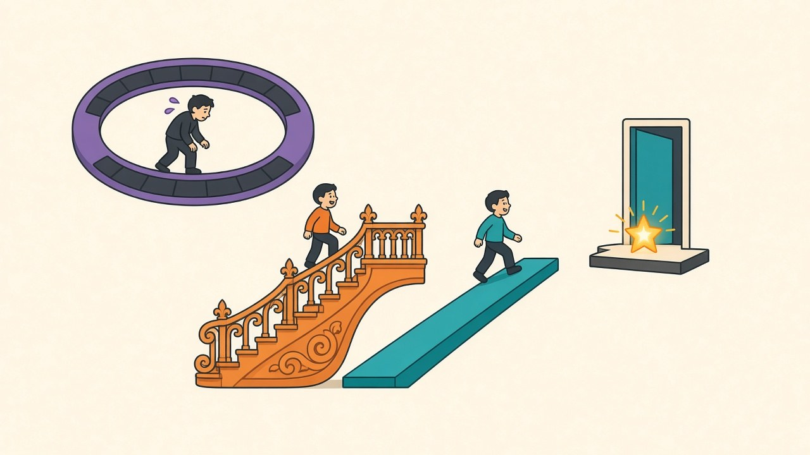

[Yesterday's optimizer face-off](/posts/sgd-vs-adam-fixed-budget) ended with "the optimizer is a hyperparameter — sweep it like one," which left an obvious accomplice unexamined: the `CosineAnnealingLR` sitting one line below the optimizer in every script this blog has ever run. I never chose cosine either; it came with the same reflex, from the same folklore package. Same treatment, then: SGD lr 0.05 at the fixed 10-epoch budget, five seeds per schedule — constant (no decay), the classic step drop (÷10 at epochs 5 and 8), linear decay to zero, and the incumbent cosine, whose numbers I already have from [yesterday's finals](/posts/sgd-vs-adam-fixed-budget) on the identical recipe and seeds.

## Decay is the feature; the curve is a detail

| schedule | test accuracy (5 seeds) | seed std |
|---|---|---|
| constant lr 0.05 | 83.22 | ±1.85 |
| step ÷10 @ 5, 8 | 87.55 | ±0.22 |
| linear → 0 | 88.62 | ±0.16 |
| cosine (incumbent) | **88.95** | ±0.31 |

The spread from worst to best is **5.7 points — the largest effect any experiment on this blog has produced**, dwarfing the optimizer's +0.71, TTA's +0.56, everything. But look at where the points live: going from *no decay* to the crudest possible decay (two step drops) recovers +4.3 of it. Upgrading the crude decay to a smooth one adds +1.1. Upgrading the smooth line to cosine's fashionable curve adds +0.33 — borderline even with paired-quality statistics (t ≈ 2.1). The ranking justifies the reflex, but deflates its mythology: **cosine isn't magic, decay is** — the annealed endpoint is doing nearly all the work that the curve's elegant shape gets credit for. Step's remaining 1.4-point deficit to cosine deserves its own asterisk: my milestones (5, 8) were picked by convention, and better ones surely exist — which is itself the argument for cosine and linear over step. They have *no milestones to mistune*. The practical rule is unglamorous: any smooth decay to zero captures ~99% of the value; between linear and cosine you're arguing over three-tenths of a point.

## The schedule was manufacturing my noise floor

The accuracy column isn't the most consequential one — the std column is. Constant LR doesn't just land 5.7 points lower; it lands with **±1.85 seed noise, eight to eleven times** the annealed schedules'. Mechanically it makes sense: with the learning rate still at 0.05 on the final epoch, the weights never settle into a minimum — they orbit it, and where the orbit happens to be when the budget expires is a per-seed lottery. Annealing to zero parks every run at the bottom of its basin, which compresses the lottery to ±0.2. This retroactively explains the finding that [most surprised me in the EMA post](/posts/ema-weights-measured): halving the learning rate cut seed noise 7x. I read that as an LR effect, but it was really a *convergence* effect — noise reflects how settled the endpoint is, and the schedule is the settling mechanism. Every paired t-test this blog has run, every ±0.15 noise floor that made +0.3 effects detectable, has been quietly subsidized by that one reflexive line of cosine. It also closes the loop on [the early-stopping autopsy](/posts/early-stopping-checkpoint-selection-measured): the last epoch was the best epoch in 15 of 15 runs *because* the schedule anneals — under constant LR, checkpoint selection would presumably earn its keep again, picking among the orbit's random passes.

So the two-day audit of my unexamined defaults ends with a split verdict. The optimizer reflex was wrong by 0.71 points. The schedule reflex was right — but I now know *why* it's right, which defaults never tell you: not the cosine curve's shape (worth 0.3), but the decay it guarantees (worth 5.4) and the reproducibility it manufactures as a side effect (worth every experiment since). Scope as always — one model, one dataset, 10 epochs; longer budgets shrink the constant-LR gap as orbits get time to descend, and warmup, which this sweep didn't need at batch 128, becomes its own variable at larger ones. The config file has one fewer line I can't defend.
