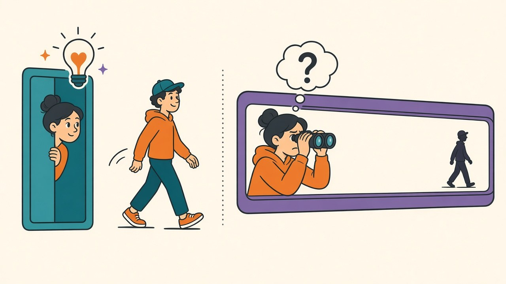

Every experiment in [my HAR series](/posts/imu-har-subject-vs-random-split) has used the dataset's native window: 128 samples at 50 Hz, 2.56 seconds of motion per prediction. I never chose that number any more than I chose [cosine annealing](/posts/lr-schedule-face-off) — it shipped with the benchmark, and it quietly sets a floor under something users actually feel: a model that needs 2.56 seconds of signal cannot react to an activity change in less than 2.56 seconds. For fall detection or exercise-rep counting, that's the difference between responsive and laggy. The window is also the compute: a 1D CNN's cost scales linearly with input length, which [matters on the CPUs these models actually serve on](/posts/cpu-vs-gpu-serving-crossover). So the question with a real deployment payoff: how much of that context is the model *using*? Center-crop the windows to 96, 64 and 32 samples, 50 paired subject splits per length, same protocol as [the augmentation tournament](/posts/har-augmentation-fifty-splits).

## A quarter of the signal, 99% of the accuracy

| window | duration | overall delta vs 128 | worst-subject delta |
|---|---|---|---|
| 128 samples | 2.56 s | — (92.66) | — (77.12) |
| 96 samples | 1.92 s | −0.11 (t = −2.8) | −0.24 |
| 64 samples | 1.28 s | −0.34 (t = −8.1) | −0.83 |
| 32 samples | 0.64 s | −0.87 (t = −10.8) | −1.98 |

Headline first: **cutting the window to a quarter — 0.64 seconds — costs 0.87 points of accuracy**, from 92.66 to 91.79. The model retains 99% of its performance while its reaction latency and per-inference compute both drop 4x. For most of the deployments I can imagine building on this, that trade isn't close: half a stride cycle of signal is evidently enough to tell walking from sitting from stair-climbing almost as well as two full cycles. The 96-sample row is even freer — a 25% latency cut for a −0.11 nick that only 50 paired splits could distinguish from zero at all (14 of 50 splits actually *improved*; a three-run comparison would have called this one "no difference" and been right in spirit).

But the curve has a shape worth respecting: each step down the table costs roughly triple the one before it (−0.11, −0.34, −0.87). This isn't a plateau with a cliff somewhere below 32 samples — it's an accelerating price, and extrapolating one more halving to 16 samples (0.32 s) suggests a multi-point drop where the model would genuinely start missing the slow periodic structure of gait. And the by-now-familiar pattern from [every experiment in this series](/posts/har-augmentation-fifty-splits): the average hides the distribution's tail. The worst-served subject loses **−1.98 at 32 samples — more than double the average cost**. The subjects whose movement style the model already struggles with are precisely the ones who need more temporal evidence to classify; shortening the window taxes them first. If your product has a per-user quality floor, the window sweep needs to be run on the worst-subject metric, not the mean.

## The convention was never a requirement

The takeaway generalizes past this dataset. Benchmark defaults encode *someone's* trade-off from years ago — 2.56 seconds presumably balanced accuracy against the memory of 2012-era phones — and inheriting them uninspected means inheriting a latency budget nobody chose on purpose. The sweep that repriced it cost eight minutes of GPU time on [the same 50-split harness](/posts/har-augmentation-fifty-splits) I already had, and it hands the deployment a menu instead of a mandate: 96 samples if accuracy is sacred, 64 as the sensible default (−0.34 for half the latency), 32 where responsiveness or battery rules, minus a worst-user tax that the mean conveniently forgets to mention. Scope: one dataset, lab-mounted waist sensors, six coarse activities, center-crops of fixed windows rather than a true re-windowing of the raw stream — finer-grained activities (gestures, sport technique) plausibly need every sample they can get. But if you're shipping a model whose window length came from a benchmark README, the sweep is cheap and the odds are good you're buying context your classifier never spends.
