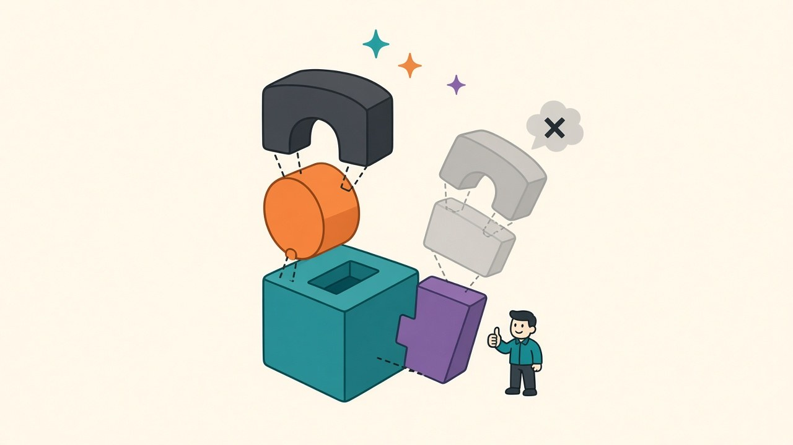

Every effect this blog has verified was measured *alone*, against a clean baseline — that's what made the statistics honest, and it's also a quiet liability. Improvements found in isolation routinely fail to stack: two tricks that each add +0.3 by smoothing the same rough edge will add +0.3 together, not +0.6, and the literature is full of ablation tables where the full recipe underperforms the sum of its parts. Having spent a month accumulating small verified wins — [Adam over SGD](/posts/sgd-vs-adam-fixed-budget) (+0.71), [label smoothing](/posts/seed-noise-vs-real-improvements) (+0.14), [EMA at decay 0.99](/posts/ema-weights-measured) (+0.08), [horizontal-flip TTA](/posts/test-time-augmentation-measured) (+0.56) — I owed the recipe a compatibility test. Three arms, five seeds each: Adam baseline, Adam + label smoothing, Adam + label smoothing + EMA, with every trained model evaluated both plain and with flip-TTA.

## The ledger balances, with interest

| recipe | plain | + flip TTA |
|---|---|---|
| Adam baseline | 89.75 ±0.23 | 90.36 |
| + label smoothing 0.1 | 90.17 (+0.41) | 90.68 |
| + EMA 0.99 | 90.25 (+0.49) | **90.77 (+1.02)** |

The prediction from the individual measurements was +0.78 on top of Adam; the stack delivered **+1.02**. Two components reproduced their solo numbers almost eerily: EMA added +0.08 on top of label smoothing — the *exact* figure from [its own post](/posts/ema-weights-measured) — and TTA added +0.52 to +0.60 across all three arms, right on its solo +0.56. Whatever failure mode each of those two corrects, it's evidently orthogonal to everything else in the recipe; TTA's mirror-averaging in particular doesn't care what optimizer or loss produced the weights, which is what you'd hope from a fix that operates on a completely different axis (the input space) than the training-side tricks.

The interest payment came from label smoothing: **+0.41 on Adam, three times the +0.14 it earned on SGD.** An effect I'd filed as "real but marginal" turned out to be context-dependent in the profitable direction — plausibly because Adam's faster convergence produces the overconfident logits that smoothing exists to tax, while 10-epoch SGD never gets confident enough for the tax to collect much. I won't over-interpret the mechanism without a dedicated experiment, but the practical lesson stands either way: an effect size measured in one context is an estimate, not a constant, and it can move by 3x when the surrounding recipe changes — in either direction. I got the direction that makes for a pleasant post; the other direction is why stacking tests exist.

## What a month of measuring actually bought

One more column worth reading: the seed noise *shrank* as the stack grew — ±0.23 for the baseline, ±0.18 with smoothing, ±0.12 with EMA on top. Each addition made runs more repeatable, not just better, compounding the [schedule's noise-manufacturing](/posts/lr-schedule-face-off) — a stack of stabilizers stabilizes. And zooming all the way out: this recipe's ancestor, the untuned SGD baseline that started the [seed-noise investigation](/posts/seed-noise-vs-real-improvements), scored 87.86. Today's full stack scores 90.77. That's **+2.9 points on the identical architecture, data and epoch budget**, assembled entirely from effects small enough that most of them would have been invisible without paired statistics — and the whole audit trail fits in a dozen blog posts with t-statistics attached. None of it required a new model, a longer schedule, or more data. It required measuring.

Scope, as ever: one dataset, one small model, one short budget, and additivity verified only for *this* combination — a different quartet of tricks could interfere where these cooperated, and the label-smoothing surprise cuts both ways. If you're assembling your own recipe from published effect sizes, budget for the stacking test; mine cost 26 minutes and converted a shelf of individually-verified parts into a machine that provably runs.
