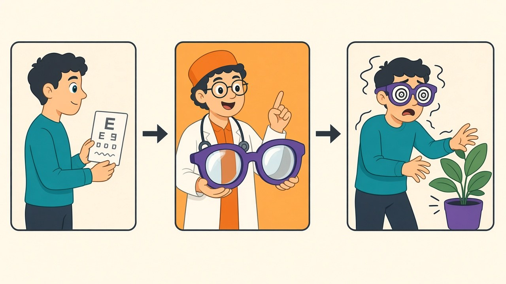

[Yesterday's stacking test](/posts/stacking-the-months-wins) left a loose end I explicitly refused to hand-wave: label smoothing earned +0.41 on Adam but only ~+0.14–0.20 on SGD, and I floated a mechanism — Adam converges further and produces more overconfident logits, so the smoothing tax collects more revenue — with the caveat that it deserved its own experiment. This is that experiment, and I get to demonstrate the blog's favorite genre from the inside: watching your own plausible mechanism die in its dedicated test. Four arms (SGD and Adam, each with and without smoothing 0.1), five seeds each, and this time the evaluation captures what accuracy alone hides: mean confidence (average max softmax probability), 15-bin expected calibration error, and negative log-likelihood.

## The hypothesis dies in one row

| arm | accuracy | mean confidence | conf − acc gap | ECE | NLL |
|---|---|---|---|---|---|
| SGD | 88.95 | 91.4 | **+2.4** | 2.56 | 0.332 |
| Adam | 89.72 | 92.5 | **+2.8** | 2.82 | 0.311 |
| SGD + LS 0.1 | 89.15 (+0.20) | 82.1 | −7.1 | 7.06 | 0.384 |
| Adam + LS 0.1 | 90.13 (+0.41) | 83.9 | −6.3 | 6.38 | 0.358 |

First, the asymmetry replicated: smoothing pays +0.41 on Adam and +0.20 on SGD, so yesterday's observation wasn't a seed fluke. But the mechanism I proposed needed Adam's overconfidence gap to be dramatically larger than SGD's, and it isn't: **+2.8 versus +2.4**. A 0.3-point difference in overconfidence cannot explain a 2x difference in smoothing's payoff. The hypothesis was plausible, directionally reasonable, and wrong — the honest ledger this blog runs on requires saying so as plainly as when [the rotation warning](/posts/imu-rotation-angle-sweep) or [the batch-512 rule](/posts/batch-512-textbook-fixes-measured) died. Why smoothing synergizes with Adam remains genuinely open; whatever it is, it isn't visible in the confidence statistics, and I'd rather carry an acknowledged unknown than a debunked explanation.

A quieter surprise in the same rows: the unsmoothed models were never the calibration disasters the literature warns about. The classic overconfidence horror stories come from big networks trained hundreds of epochs into memorization; my 10-epoch models claim 91–92% and deliver 89–90 — a gap of two-and-a-half points, ECE around 2.6. Mildly vain, basically trustworthy.

## The trade nobody mentions when recommending label smoothing

Then look at what smoothing did to those honest probabilities. Confidence collapsed from 91.4 to 82.1 on models that are *89% accurate* — smoothing didn't correct the +2.4 overconfidence, it **overshot it into −7 underconfidence, tripling ECE** (2.56 → 7.06) and worsening NLL (0.332 → 0.384) while improving top-1 accuracy. Mechanically this is exactly what training toward soft targets promises: with smoothing 0.1, the loss is minimized by predicting ~0.91 for the true class *before* the model's own uncertainty discounts it further, so the output distribution is systematically deflated regardless of how sure the evidence is. The folklore that "label smoothing improves calibration" isn't a law — it's a coincidence that holds when the starting overconfidence happens to be about the size of the smoothing dose. Mine was +2.4 points overconfident and I administered a ~9-point correction.

Whether that trade is good depends entirely on what consumes the outputs. If your model feeds an argmax — a classifier API returning the top label — smoothing here is pure profit: +0.2 to +0.4 accuracy, and the mangled probabilities cost nothing. But the moment anything downstream *reads the numbers* — confidence thresholds routing uncertain cases to humans, risk-weighted decisions, [probability-averaging ensembles like TTA](/posts/test-time-augmentation-measured), monitoring that alarms on confidence drift — you've traded a well-calibrated 89% model for an 89-pretending-to-be-82 model, and every threshold downstream is now miscalibrated by seven points in the conservative direction. A confidence gate set at 0.9 that used to pass most correct predictions would suddenly reject the majority of them. Scope: one dataset, one smoothing dose (0.1 — a smaller dose would overshoot less; the dose-response sweep is an obvious sequel), 10-epoch budgets where baseline overconfidence is mild. But the checklist item generalizes: label smoothing's accuracy gain is advertised on the box; the probability deflation is not, and temperature scaling on a validation set — or just knowing your model now lowballs itself — belongs in the same commit that adds `label_smoothing=0.1`.
