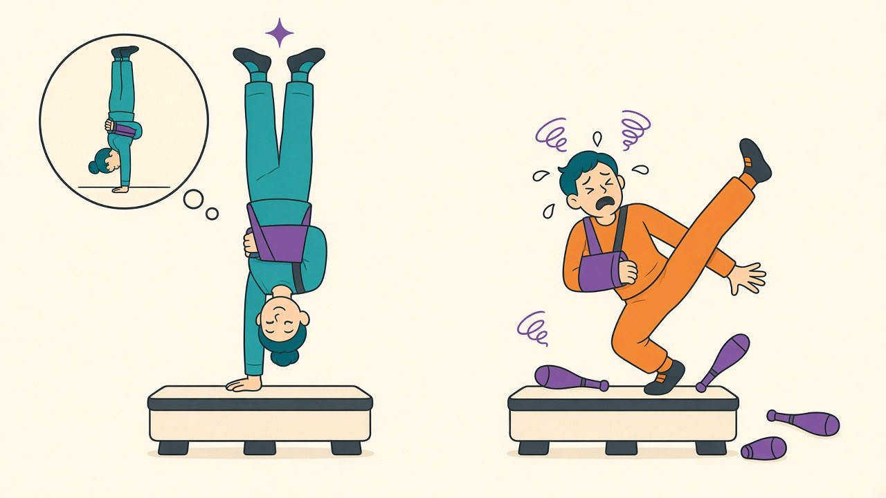

Every model in [my HAR series](/posts/imu-har-subject-vs-random-split) consumes nine channels: body acceleration, gyroscope, total acceleration, three axes each. That input contract is signed in blood nowhere. Real wearables power-gate the gyroscope to save battery — it's the hungriest sensor in the IMU — cheaper product SKUs ship accelerometer-only, and drivers occasionally just stop delivering a channel. What arrives then is not a graceful degradation but a model fed zeros where a sensor used to be, a failure mode I've never tested in eleven posts of training these networks. So, [the 50-split harness](/posts/har-augmentation-fifty-splits) again, with three models per split: the standard 9-channel model, the same architecture trained with *channel dropout* (each batch sample has its gyro triad zeroed with probability 0.5), and a dedicated 6-channel accelerometer-only model. Dead gyros are simulated by zeroing the triad in normalized space, and every comparison is paired within split.

## The autopsy distinguishes injury from shock

| configuration | accuracy | paired delta vs healthy baseline |
|---|---|---|
| standard model, all sensors healthy | 92.66 | — |
| standard model, **gyro dead** | 89.82 | **−2.83 (t = −15.4)** |
| accel-only model (never had a gyro) | 91.72 | −0.94 |
| dropout-trained, all sensors healthy | 92.36 | −0.29 |
| dropout-trained, **gyro dead** | **91.83** | **−0.83** |

Two numbers define the problem. The unprepared model loses **2.83 points** when the gyro flatlines. But the accel-only model — which proves what six channels can achieve when a network actually learns to use only them — sits just **0.94** below the full baseline. The gyroscope's entire informational contribution is worth about one point; the other 1.9 points of the crash are **distribution shock** — the model's conv filters expect correlated gyro structure, receive constant mean values instead, and the disturbance propagates through features that mix channels. The failure costs three times what the lost information justifies, which is the signature of a model that was never shown the failure.

Channel dropout is the vaccine, and its price-performance is hard to argue with. Trained with gyro-dropout at p = 0.5, the model pays a **0.29-point premium while all sensors are healthy** — real (t = −3.4) but small — and in exchange, its dead-gyro accuracy lands at 91.83: the crash shrinks from −2.83 to −0.83, *under* the informational floor set by the dedicated accel-only model (91.72). One set of weights now covers both operating modes at essentially the dedicated-model price in each: a tenth of a point behind the specialist when healthy, a tenth ahead of it when crippled. If your product has any sensor-failure or battery-saving mode in its spec sheet, this is about the cheapest robustness purchase [this series](/posts/har-augmentation-fifty-splits) has priced — three lines of augmentation code, no extra models to ship or select between at runtime.

## The general rule hiding in the sensor budget

Two broader readings. First, for hardware planners: the gyro's one-point value is worth weighing against its battery draw — these numbers say an accel-only SKU concedes less accuracy than [a random train/test split overstates by](/posts/imu-har-subject-vs-random-split), and if the gyro stays, power-gating it opportunistically is nearly free *provided the model trained for it*. Second, the autopsy's shape generalizes beyond IMUs: whenever an input source can vanish at inference — a sensor, a feature pipeline, a metadata field — the cost of its absence splits into information actually lost and shock from a condition never seen in training, and only the first part is irreducible. You find the split by training the amputated specialist (the floor) and comparing it to the surprised generalist (the crash); the gap between them is recoverable, and input dropout recovers nearly all of it. Scope: one dataset, one failure pattern (clean triad-wide zeros — real sensor death can be noisier and partial), lab-grade mounting, and a dropout rate I didn't sweep. But the headline survives every caveat I can think of: my model's gyro dependence was two-thirds habit, one-third need, and three lines of training code converted the habit into insurance.
