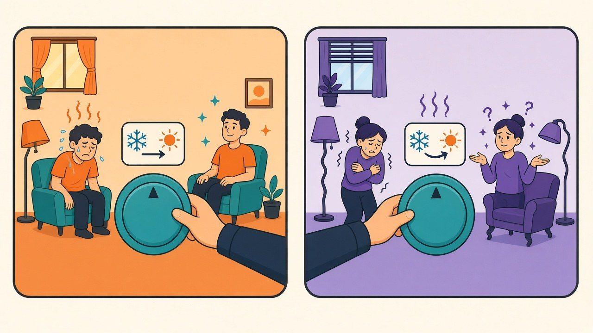

The calibration arc so far: [my models are mildly overconfident](/posts/label-smoothing-calibration-measured), label smoothing at the standard dose [overcorrects into severe underconfidence](/posts/label-smoothing-calibration-measured), and the right dose [fixes both at once](/posts/label-smoothing-dose-response) — but only if you pick it before training. What's been missing is the post-hoc tool, the one that works on a model you already have: temperature scaling. Divide every logit by a single fitted scalar T; T > 1 softens an overconfident model, T < 1 sharpens an underconfident one, and because the division never changes which logit is largest, **accuracy is untouched by construction**. It's the simplest idea in the calibration literature, which is exactly why it deserves a measurement: five seeds each of my two broken models — plain Adam (overconfident by ~3) and Adam with smoothing 0.1 (underconfident by ~6) — with T fitted by NLL on a held-out validation set, at three validation sizes, because the fitting data has a price [this blog has already paid once](/posts/early-stopping-checkpoint-selection-measured).

## The repair bill, itemized

| model | ECE before | fitted T | ECE after | accuracy |
|---|---|---|---|---|
| Adam (overconfident) | 3.13 | 1.25 ±0.06 | **1.01** | 89.31 → 89.31, bit-identical |
| Adam + LS 0.1 (underconfident) | 6.21 | 0.75 ±0.03 | 2.03 | 89.80 → 89.80 |

The overconfident model is the advertised success story: one scalar, fitted in seconds, cuts ECE to a third, improves NLL, and the confidence gap drops from +3.0 to half a point — while the accuracy column confirms the monotonicity guarantee with bit-identical numbers. The tool also proved genuinely bidirectional: handed the smoothing-deflated model, the fit correctly chose T = 0.75 and *sharpened*, recovering most of the NLL damage. But not all of it — and the residual is the interesting part. The smoothed model's post-repair ECE settles at ~2.0, double what the plain model achieves, because label smoothing's distortion isn't a pure temperature change: it reshapes the whole logit distribution in a way one global scalar can't invert. Yesterday's conclusion survives contact with the repair shop: **training at the wrong smoothing dose does damage that post-hoc calibration only two-thirds undoes.** Fix the dose, or skip smoothing and scale afterwards — the two cleanest probability profiles I've measured are LS 0.02 natively (ECE 1.21) and LS 0 plus temperature (ECE 1.01), and both beat smoothing-then-repairing.

## Five hundred labels, not five thousand

The standing objection comes from [my own early-stopping post](/posts/early-stopping-checkpoint-selection-measured): validation sets are expensive — 5,000 images held out of training cost 0.86 points of accuracy, visible again here as the 45k-trained arms scoring ~0.4 below their 50k siblings. If temperature scaling demanded a big validation set, its "free calibration" would carry the same hidden invoice. So the sweep: T fitted on 500, 1,000 and 5,000 validation samples. The answer is emphatic — **T@500 matches T@5000 to within noise** (fitted values 1.25 vs 1.24, post-fit ECE 1.01 vs 1.09; same story on the underconfident arm). A one-parameter model doesn't overfit 500 points; the information bottleneck that makes big validation sets necessary for *checkpoint selection* (choosing among many similar candidates) simply doesn't exist when you're estimating a single scalar. Hold out 500 images — a 1% tax on training data, costing maybe a twentieth of a point — or reuse any small labeled batch you already have, and the repair is effectively free.

The arc closes with a tidy decision table. Shipping an argmax API: do nothing, probabilities don't matter. Training from scratch with probability consumers downstream: smoothing 0.02 — accuracy gain plus native calibration. Holding a trained model you can't retrain: temperature on 500 held-out labels, full repair if the model is merely over/underconfident, partial if someone trained it at smoothing 0.1. Scope: one dataset, 10 classes, 10-epoch budgets, in-distribution test data — temperature famously drifts when the test distribution shifts, and nothing here measures that. But within its lane, this is the best effort-to-impact ratio the calibration series found: a hundred training runs to understand the problem, one scalar to fix it.
